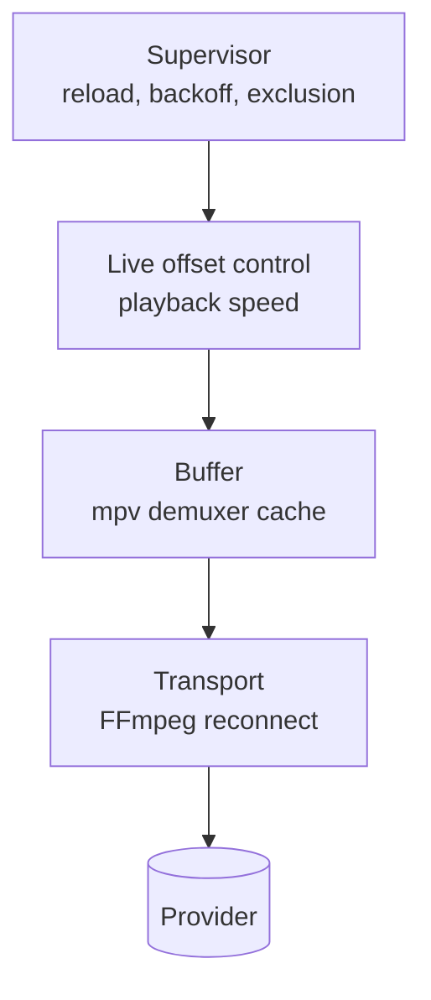

# Live Playback Design

## Context

Coax plays live IPTV from a provider whose streams stall intermittently. Three
distinct concerns hide behind "make playback reliable", and conflating them
produces a player that is either fragile or needlessly far behind live:

1. **Absorb jitter** — a short network stall should not reach the screen.
2. **Recover from loss** — a dropped connection should re-establish itself.
3. **Hold latency** — drift away from the live edge should be corrected, not
   accumulated.

ExoPlayer separates all three, and is the reference this design follows.

## Constraints

- **libmpv is the playback engine.** The current wrapper exposes no per-segment
  load hooks. Fine-grained retry therefore belongs to FFmpeg beneath mpv;
  anything coarser belongs to Coax above it. libmpv does have an unstable
  custom-stream callback API, so inserting a Coax-owned transport is possible,
  but it would be a substantial replacement for the current URL-loading path.
- **The provider's continuous TS endpoint carries no manifest.** Unlike HLS or
  DASH, it does not state where the live edge is, so true live offset is not
  observable. This is a property of the endpoint, not every MPEG-TS resource.
- **The provider's continuous TS endpoint is not seekable.** Latency cannot be
  corrected by seeking outside mpv's local cache. Playback rate is the current
  non-disruptive control surface.
- **The engine is mostly opaque.** Coax observes mpv properties, structured
  events and selected warning logs, then issues commands; it does not inspect
  demuxer or decoder internals directly.

## Design

Four layers, each handling failures the layer below could not.



### Transport recovery

When mpv uses FFmpeg's network backend, FFmpeg's HTTP layer can reconnect
beneath mpv, re-establishing a dropped TCP connection without the file ever
ending. It is the only configured layer that could recover without a visible
interruption — and it is **disabled by default here**, because on this provider
stream the cure was worse than the disease. Current mpv can instead be built
with a libcurl HTTP backend, so `stream-lavf-o` must not be assumed to control
every future runtime. Coax should record `mpv-version`, `mpv-configuration` and
`ffmpeg-version` at startup and verify the active transport backend when this
experiment is enabled.

FFmpeg reconnects by re-opening the URL and attempting to resume the stream. On
the provider endpoint no correct byte resume point exists: in observed failures
the server answered from its own buffer and playback replayed content it had
already shown. The observed symptom was video repeating a section indefinitely;
this is provider evidence, not a universal property of every TS server.

That observed failure was invisible to the signals Coax watched: reconnection
happened below mpv, the demuxer cache did not drain, `paused-for-cache` did not
fire, and no rebuffer was recorded. A silent log and apparently healthy cache
metrics accompanied visibly broken playback. These observations should be
revalidated when the provider or pinned FFmpeg runtime changes.

`reconnect_streamed=1` is the specific option to avoid for the observed
provider: FFmpeg documents it as enabling reconnection for streamed/non-seekable
inputs, which is exactly the path that produced unsafe replay here. It is not a
universal rule for all non-seekable servers.

`PlayerConfig::transport_reconnect` re-enables a reduced set — `reconnect`,
`reconnect_on_network_error`, `reconnect_delay_max` — so the approach stays
comparable against a real provider. Without `reconnect_streamed`, that set may
not recover a mid-stream error on a non-seekable source; it is an experiment,
not a second guaranteed recovery path. For this provider the supervisor opening
a fresh request is the preferred recovery mechanism.

### Buffer

Capacity and latency are **different but coupled concerns**. The cache ceiling
and readahead limit determine how much jitter can be absorbed, while live-offset
control decides whether accumulated delay is retained. On a live source,
however, initial fill, refill waits and server-side burst delivery can directly
add latency. ExoPlayer likewise separates load control from live-speed control,
but that separation does not make the two independent.

| Concern | Setting |
|---|---|
| Zap target (each new load) | `cache-secs=1`, `demuxer-readahead-secs=1` |
| Steady target (after five healthy seconds) | `cache-secs=10`, `demuxer-readahead-secs=10` |
| Capacity ceiling | `demuxer-max-bytes=64MiB` |
| Back-buffer ceiling | `demuxer-max-back-bytes=16MiB` |
| Resume threshold after a rebuffer | `cache-pause-wait=2` |
| Behaviour on a dry cache | `cache-pause=yes`, `cache-pause-initial=yes` |

Pausing to refill beats stuttering through an empty cache. The two-second value
matches ExoPlayer's `BUFFER_FOR_PLAYBACK_AFTER_REBUFFER_MS` of 2000, but the
semantics differ: Media3 explicitly defines a rebuffer as depletion after
playback and excludes initial buffering and seeking. In the exact mpv source
commit pinned by Coax, `cache-pause-initial` enables the shared low-cache path
before playback has started, and that path compares buffered duration with
`cache-pause-wait`. Initial fill and later underruns therefore publish the same
`paused-for-cache` state, although the later-underrun path has additional
underrun conditions. Coax must distinguish those phases itself.

The 64 MiB value is a chosen byte ceiling, not a phase target or an allocation.
The repository does not yet contain measurements that establish it as an
optimal value. It is set when libmpv is created and never rewritten during a
load. The two time targets are
reasserted at one second for every load because a preceding steady load may
have widened them. They are changed to ten seconds once per load, only for the
active generation. Both asynchronous property-command results are observed and
reported in diagnostics. The phase names the intended per-load policy, while a
separate command state remains pending until both succeed and becomes explicitly
failed if either is rejected; a partial command is never reported as confirmed.

The table above documents policy, but its values do not have one home each.
Three patterns are in use, and only one of them is right.

**Single-homed, and the pattern to follow.** The steady targets are written once:
`buffer_phase_targets(BufferPhase::Steady)` in `policy.hpp` is the only place ten
seconds appears, and the adapter reads it rather than restating it.

**Written twice.** `buffer_phase_targets(BufferPhase::Zap)` declares one second,
and `mpv_player.cpp` separately passes `"1"` for both `cache-secs` and
`demuxer-readahead-secs` when libmpv is created. Changing the policy would leave
mpv created at the old value until the first `apply_buffer_phase` overwrote it,
so the two can disagree for the whole window before the first load.

**A constant nothing reads.** `core::kDemuxerMaxBytes` declares 64 MiB in
`policy.hpp` while `mpv_player.cpp` passes the literal `"64MiB"`. The core test
pins the declared constant but cannot observe the applied literal, which makes
the coverage boundary misleading rather than absent.

**No policy home at all.** `cache-pause-wait=2` is documented here and reasoned
about against ExoPlayer's 2000 ms, but exists only as a string in the adapter.
`demuxer-max-back-bytes=16MiB` is a memory-policy value the measurement section
below already expects to read back, and it is not in `policy.hpp` either.

Every one of these agrees with its documented value today, so none is a current
runtime mismatch. The cost is drift risk, and a test surface that reads as
stronger than it is.

One fix covers them all: every tuning value in the table gets exactly one
definition in `policy.hpp`, and the adapter serialises those definitions into
mpv option values instead of repeating them. `cache-pause` and
`cache-pause-initial` are behavioural switches rather than tuning values and can
stay as they are. Where initialisation grows, build the option set in a small
function returning name/value pairs and assert on the result, which needs no
live mpv. The option-set builder belongs in the player layer. Numeric byte
counts and durations remain vendor-neutral policy in `policy.hpp`; only mpv
option names such as `demuxer-max-bytes` stay out of `coax_core`. The portable
half of `coax_player` is the right home for that mapping, which makes this and
the player-target split the same piece of work.

Socket timing and probing remain separate from buffer policy. Coax does not set
`network-timeout`, `demuxer-lavf-analyzeduration`, or
`demuxer-lavf-probesize` in the default configuration. Provider MPEG-TS can
need a complete PMT before tracks appear, and prolonged silence is classified
by the multi-signal health fold rather than a per-file socket deadline.

### Live offset control

A proportional controller attempts to hold playback a target buffered duration
by nudging playback speed. It is a reduced controller inspired by ExoPlayer's
`DefaultLivePlaybackSpeedControl`, implemented in
[live_sync.hpp](../../src/player/live_sync.hpp).

```text
error = buffered - target
speed = clamp(1.0 + 0.1 * error, 0.97, 1.03)
```

with a ±20ms deadband holding speed at exactly 1.0, and updates rate-limited to
once per second. Each rebuffer concedes 500ms of target offset, bounded at 30s.

The controller can remove buffered duration above its current target by running
up to 3% fast. Pitch correction is enabled, which reduces pitch changes, but
whether a 3% tempo change or correction artifacts are audible is content- and
listener-dependent and still needs listening tests.

The 500ms concessions themselves currently **do ratchet**: `notify_rebuffer()`
raises the target and nothing decays it toward the initial target. The
controller claws back only excess above the newly raised target. This differs
from ExoPlayer, which also smooths the minimum possible live offset and adjusts
its current target back toward a safe ideal.

`LiveSync` is free of Windows, mpv and UI types, so the control law is testable
in isolation and portable to another platform. It does not currently have a
direct test suite; the application integration is also untested.

#### The proxy, and why it is one

ExoPlayer can expose a current live offset when its media timeline provides
enough wall-clock and live-window information; Android documents that value as
"if available", not guaranteed for every HLS or DASH stream. A manifest alone
does not necessarily establish true wall-clock latency. Coax has no manifest
for the provider's TS stream, so the controller uses mpv's
`demuxer-cache-duration` as a stand-in. mpv documents that property as an
approximate, very unreliable guess that is often unavailable even when data is
buffered. Buffered duration and live offset may move together, but they are not
the same quantity and the estimate can drift or disappear.

The diagnostics overlay states that the offset is estimated and does not
present it as measured. Where a provider offers `.m3u8` with usable live-window
timing, a manifest-derived offset can be better, but Coax does not currently
extract one: HLS would still feed demuxer buffered duration to this controller.

#### Known live-sync correctness gaps

These are implementation defects, rather than accepted trade-offs:

1. When `demuxer-cache-duration` is unavailable, the adapter preserves an
   optional value for health but separately converts it to `0.0` for
   `LiveSync`. Against a positive target this installs `0.97x`, which can add
   roughly 108 seconds of latency per hour if telemetry remains unavailable.
   The safe state is `1.0x` with no controller update until a valid measurement
   arrives.
2. `cache-pause-initial=yes` makes mpv enter the same `paused-for-cache` state
   used for an actual underrun. The application counts every rising edge as a
   rebuffer, so a normal initial fill and each recovery load can add 500ms to
   the target before playback has been interrupted. Rebuffer learning must be
   gated on first playback having started.
3. While `paused-for-cache` or `core-idle` is true, the application returns
   without setting speed. It therefore retains the previously installed
   `0.97x` or `1.03x`; it is not literally held at `1.0x` as previously stated.

### Supervisor

The portable supervisor handles failures that buffer absorption cannot. Its
pure reducer consumes generation-scoped events and injected monotonic time; a
host owns one deadline re-derived from the latest state. The fixed retry
schedule is `[500, 1000, 2000, 4000, 5000]` milliseconds, with a 30-second
wall-clock budget for the whole recovery episode. The attempt count clears only
after the recovered load produces a first frame and then remains healthy for
five seconds. A first frame by itself is not recovery evidence.

The base schedule is truncated exponential backoff, but it is deterministic.
Network retry guidance recommends adding jitter so many clients do not retry a
broadcast outage in lockstep, retrying only idempotent requests after plausibly
transient failures, and honoring `Retry-After` where the transport exposes it.
Fresh stream GETs are idempotent at the HTTP layer, but classification still
needs transport and request context: timeouts, disconnects, 408, 429 and 5xx
responses are normally retry candidates; known credential or configuration
failures are not. HTTP status alone cannot provide every distinction. RFC 9110
allows a 403 for reasons unrelated to credentials and says a 404 does not reveal
whether absence is temporary or permanent. A future context-aware classifier
should treat failure of a just-advertised HLS segment as transient within the
combined demuxer/supervisor error budget. A missing initial channel endpoint can
be terminal only when the request role or provider contract establishes that
meaning; unknown cases retain bounded generic recovery.

The host queues emitted effects and drains them from the outermost dispatch
frame. A synchronous load result therefore becomes a later reducer event rather
than re-entering the reducer or duplicating state-change callbacks.

Continuous MPEG-TS recovery reopens the resolved stream. An HLS recovery branch
performs a fresh replace load using `live_start_index=-1`, which selects the
last advertised segment. That is **not standards-aligned normal HLS startup**:
RFC 8216 says a client should not choose a segment starting less than three
target durations from the playlist end because doing so can trigger stalls.
FFmpeg's longstanding default is `-3`, and `prefer_x_start=1` can honor a
provider's `EXT-X-START`. Segment count is only an approximation of target
duration, so the preferred policy is to honor a valid server start point and
otherwise retain a conservative demuxer default unless provider measurements
justify something closer to the edge.

The branch also disables persistent and multiple HTTP connections, even though
FFmpeg enables both by default. Those are connection/performance controls, not
retry controls, and should remain at upstream defaults unless a reproducible
provider fault justifies overriding them. `seg_max_retry=0` is already FFmpeg's
default. These settings do **not** disable all playlist error handling:
`max_reload` and `m3u8_hold_counters` remain at FFmpeg defaults.

Normal HLS playlist refresh must not be disabled: RFC 8216 requires clients to
reload a live Media Playlist periodically. The architectural goal should be to
leave normal refresh and prefetch inside the demuxer while bounding error retry
and surfacing exhaustion to the supervisor, with one documented total budget
across both layers.

The HLS branch is implemented and reducer-tested but currently unreachable in
the application: both Xtream and direct-media loads are unconditionally tagged
as MPEG-TS. Before claiming HLS support, transport selection and an integration
test must make that branch reachable.

A classified format-probe failure spends one normal attempt on a reopen with an
explicit demuxer format. Exact HTTP 401 log patterns are terminal authentication
failures. The current classifier intentionally does not classify a 403 or a
status-only 404 as terminal. If mpv subsequently emits a structured end, the
application dispatches a generic `StreamEnded` after its log-correlation window,
and the failure consumes the normal attempt schedule and wall-clock budget; it
is not retried indefinitely. HLS segment-specific failure wording can instead
be classified as `HlsSegmentUnavailable`. An unavailable recovery target or
rejected local load effect is terminal as `SourceUnavailable`.

A libmpv shutdown or event-queue failure emits one `recreate-player` effect.
That effect destroys and initializes the in-process libmpv owner, then reloads
the same generation, transport, and active forced-probe mode; the HWND, UI, and
process remain alive. The same five-attempt schedule and nominal 30-second
budget bound recreation. The budget is checked when scheduling the next
attempt; if the UI thread handles an already-scheduled deadline late, that
overdue attempt can still start after 30 seconds. A stale effect cannot replace
a newer channel because the player checks the generation before acting and the
reducer drops every mismatched outcome.

Playback health is a separate pure fold sampled every 500 ms. It requires
agreement between playback progress, cache depletion, and input advance across
multiple observations. Open stalls confirm after eight seconds, progress
stalls after one second and at least three observations, and decode stalls
after six seconds and at least eight observations. A single mpv level never
starts recovery. Timeline discontinuities compare media movement with elapsed
monotonic time:

```text
abs((currentPlayback - previousPlayback) - elapsed) > 1 second
```

Forward discontinuities that still make progress can be diagnostic only. A
backward or no-progress discontinuity can classify the sample as degraded,
emit `PlaybackInterrupted`, restart the steady window and, if degradation
continues, contribute to decode-stall recovery. The health discontinuity
counter resets per load and remains distinct from the number of
`MPV_EVENT_PLAYBACK_RESTART` edges reported by mpv.

### Cross-cutting: generations

Every load intent carries a monotonically increasing generation. A reload,
retry or recovery action belonging to a superseded generation is discarded.
Without this, a slow retry can resurrect a channel the viewer has already left
— the failure mode that makes rapid channel changing feel broken.

Only a new user channel intent advances the generation. Recovery reloads and
player recreation retain it. Async load and buffer commands are stamped when
issued, while playlist entry IDs correlate later start, first-frame and
structured end events back to that generation. The adapter journals every edge
in order; draining several libmpv events in one frame cannot collapse them into
a mutable diagnostics snapshot. Player recreation retains the load generation
but resets `LiveSync` target state and the displayed rebuffer count.

## Audit validation and priorities

Validated against commit `f8a77d8` on 2026-08-05. The native core suite passed
66 tests and the Windows adapter executable passed 120 assertions in 15 test
cases. These results strongly cover the supervisor, health fold, generations,
event correlation and buffer-command gate. They do not cover the `LiveSync`
control law or `App::update_live_sync`, where the highest-impact gaps sit.

Primary-source web and code fact-check refreshed on the same date:

| Area | Result | Best-practice alignment |
|---|---|---|
| mpv buffered-duration telemetry | Confirmed: `demuxer-cache-duration` is approximate, very unreliable and often unavailable | Preserve validity and fail safe at `1.0x`; never reinterpret missing telemetry as zero |
| Initial buffering versus rebuffer | Confirmed against the pinned mpv source: initial fill and later underruns share the `cache-pause-wait` threshold and `paused-for-cache` state, though later underruns have additional trigger conditions; Media3 excludes initial buffering and seeks from `notifyRebuffer` | Gate rebuffer learning on first playback start |
| ExoPlayer comparison | Constants and proportional term confirmed; full controller also consumes live offset and buffered duration, smooths feasibility and adapts its target | Describe Coax as inspired by, not a port; do not claim manifest live offset unless it is actually available |
| HLS start position | Contradicted: `-1` selects the last segment, while RFC 8216 recommends at least three target durations from the end for normal playback | Honor valid `EXT-X-START` or use a conservative demuxer default; do not equate the last segment with a robust live start |
| HLS retry and connection options | Confirmed: `seg_max_retry=0` is the default; persistent/multiple HTTP settings are not retry controls; normal playlist refresh is required | Keep normal refresh below Coax, bound error retries across layers, and leave connection defaults alone without provider evidence |
| Supervisor retry timing | Partially aligned: delays are capped exponential and recovery is bounded, but there is no jitter or `Retry-After` handling | Add bounded jitter and response-aware retry before broad distribution; enforce the wall-clock budget again when an attempt becomes due |
| Runtime provenance | mpv exposes `mpv-version`, `mpv-configuration` and `ffmpeg-version`, but Coax currently logs only the client API version | Record runtime versions/configuration so transport behavior can be tied to the shipped artifact |
| Buffer ceiling application | The policy constant and applied mpv string both equal 64 MiB today, but neither drives the other and the core test observes only the constant | Serialize the numeric policy value at the adapter boundary so policy, implementation and test cannot drift independently |

| Priority | Finding | Practical effect |
|---|---|---|
| P1 | Preserve unavailable cache duration and hold `1.0x` until valid telemetry arrives | Prevents an unavailable mpv property from installing `0.97x` and continuously accumulating live latency |
| P1 | Count rebuffer only after first playback has started | Prevents normal initial fill and recovery opens from adding 500ms to the target |
| P1 | Add direct `LiveSync` and application-integration tests | Covers telemetry loss, initial buffering, stall entry/exit, rate limiting, target bounds and reset behavior |
| P2 | Decide and document target decay semantics | The present controller intentionally or accidentally retains every 500ms concession until reset; it does not reproduce ExoPlayer's adaptive target |
| P2 now; P1 before HLS support | Replace `live_start_index=-1`, make transport selection real and test the complete HLS load path | Avoids standards-disfavored edge startup and makes the currently unreachable recovery branch real |
| P2 | Remove HLS connection overrides unless reproduced provider evidence requires them; define one error-retry budget across FFmpeg and Coax | Preserves normal playlist refresh and avoids mistaking connection strategy for retry control |
| P2 | Add bounded jitter, response-aware retry and due-time budget enforcement | Avoids synchronized retry waves, respects transient/permanent distinctions and makes the 30-second bound real |
| P2 | Install `1.0x` on stall entry and recompute on exit | Makes the risk mitigation true and avoids retaining a stale speed through buffering |
| P2 | Log mpv, build-configuration and FFmpeg version properties | Makes future transport and option claims reproducible against the shipped runtime |
| P2 | Give every buffer-table tuning value one definition in `policy.hpp` and serialise it at the adapter boundary | Removes the duplicated zap targets, the unread byte-ceiling constant, and the pause-wait and back-buffer literals that have no policy home, so documented, tested and shipped policy cannot diverge |
| P3 | Measure the 64MiB ceiling, 10s steady limit and ±3% audio range on representative channels | Converts reasonable starting values into provider- and device-backed policy |

### Evidence required before policy tuning

Playback policy should be changed from repeatable evidence rather than one
successful channel or a single provider outage. At minimum, compare candidate
settings on the same representative channel set and record:

- zap-to-first-frame time and initial buffering time, reported separately;
- rebuffer count, total rebuffer duration and time-to-resume per playback hour;
- recovery detection-to-first-frame time, attempt count and terminal-failure
  rate by classified cause;
- buffered-duration availability, controller speed duty cycle and target
  changes, without relabelling the proxy as measured live offset;
- dropped/late frames, decode degradation and A/V sync while speed correction
  is active; and
- process memory together with demuxer forward/back-buffer readings.

The regression matrix should include unavailable cache telemetry, initial fill,
brief jitter that the cache should absorb, a connection reset, prolonged input
silence, repeated/backward timestamps, authentication failure, rapid channel
changes and player recreation. HLS adds playlist stagnation, a missing segment,
`EXT-X-START`, a sliding live window and startup at the conservative live
position. Provider testing remains necessary for the observed TS replay case,
which unit tests cannot reproduce from mpv properties alone.

## Trade-offs

**Latency for stability.** Each rebuffer concedes 500ms. On a persistently bad
channel the controller settles further behind live rather than fighting a
losing battle, up to the 30s ceiling. For live sport this is a real cost — a
phone notification can arrive before the picture — which is why the increment
is small. The current controller retains each increment and claws back only
additional buffered duration above the raised target.

**Buffer memory for absorption.** The 64 MiB cache ceiling is a ceiling, not an
allocation, and remains a tuning value rather than a measured optimum.
Time-based buffering moves from 1 second during zap to 10 seconds after the
healthy window, so every channel does not pay steady opening-read costs before
its first frame. A server that can deliver buffered content faster than real
time can still turn some of that readahead into live latency.

**Bounded recovery can surface failure.** Five attempts and a nominal 30-second
budget prevent a dead provider or broken decoder from producing an infinite
reopen loop. Due-time budget enforcement remains a required fix for the late UI
poll edge case. The cost is an explicit failed state that needs a new channel
intent; diagnostics retain the detection, current attempt, elapsed budget and
policy version.

**Learned latency is discarded on channel change or player recreation.**
Latency learned on a bad channel says nothing about the next one, and carrying
it over would penalise good channels for their neighbours. Backend recreation
also resets it even though the stream generation remains unchanged; this is an
implementation simplification rather than a channel-policy decision.

## Alternatives considered

**Per-channel learned buffer, growing by a fixed amount per interruption, with
decay.** Not implemented. The speed controller does not subsume this: buffer
depth controls jitter absorption, while playback speed controls accumulated
latency. A learned buffer remains a possible provider-specific policy, but it
needs representative interruption data, bounds and decay behavior before its
complexity is justified.

**Larger fixed buffer for everything.** Rejected: penalises every channel for
the worst one and can add latency. Valid live-offset control can remove excess
latency slowly, but at a 3% speed ceiling each second of excess takes about 33
seconds to recover.

**Replacing the engine.** libVLC exposes D3D11 output callbacks that let the
host own the device, which is architecturally cleaner for composition. Rejected
for playback reasons: mpv's tuning surface and quality path are why this
project exists.

## Risks

| Risk | Mitigation |
|---|---|
| Buffered duration is a poor or unavailable proxy for live offset | Diagnostics state the offset is estimated; required fix is to hold `1.0x` whenever the property is unavailable |
| Initial buffering is mistaken for a rebuffer | Required fix is to gate learning on first playback start |
| Speed changes become audible | Pitch correction enabled and range capped at ±3%, matching ExoPlayer's defaults; representative listening tests remain outstanding |
| Reconnect options silently rejected by a future libmpv | The wrapper logs every rejected option at startup |
| Controller fights a stall instead of riding it out | Updates are suspended during `paused-for-cache` or `core-idle`; required fix is to actively install `1.0x` on entry and recompute on exit |
| HLS starts too close to the playlist edge (latent while the HLS branch is unreachable) | Required fix is to replace `live_start_index=-1`, prefer a valid `EXT-X-START`, and otherwise retain a conservative start |
| HLS connection overrides reduce robustness or throughput | Leave FFmpeg's persistent/multiple HTTP defaults enabled unless a provider-specific failure is reproduced |
| Many clients retry a provider outage in lockstep | Add bounded jitter to the capped exponential schedule while preserving the total recovery budget |
| Warning-log wording changes in mpv or FFmpeg | Exact failure classification can fall back to generic end handling; keep classifier fixtures aligned with the pinned runtime |
| The shipped mpv network backend or FFmpeg version changes | Log `mpv-version`, `mpv-configuration` and `ffmpeg-version`; validate transport options against those values |
| Declared buffer policy and applied mpv value diverge | Remove the duplicate `"64MiB"` literal and format `core::kDemuxerMaxBytes` for the mpv option |
| Fixed policy values do not match real provider behavior | Capture per-channel buffer, interruption, recovery and live-latency measurements before retuning |

## Upstream references

- [Pinned mpv cache options](https://github.com/mpv-player/mpv/blob/304426c390901436fb1d4a63efbd582ae80c88f4/DOCS/man/options.rst)
- [Pinned mpv playback properties](https://github.com/mpv-player/mpv/blob/304426c390901436fb1d4a63efbd582ae80c88f4/DOCS/man/input.rst)
- [Pinned mpv cache-pause implementation](https://github.com/mpv-player/mpv/blob/304426c390901436fb1d4a63efbd582ae80c88f4/player/playloop.c)
- [FFmpeg HTTP reconnect documentation at the revision checked on 2026-08-05](https://github.com/FFmpeg/FFmpeg/blob/d295add2225e1ad9ba9d55cb612cce50072dc45d/doc/protocols.texi)
- [FFmpeg HLS demuxer documentation at the revision checked on 2026-08-05](https://github.com/FFmpeg/FFmpeg/blob/d295add2225e1ad9ba9d55cb612cce50072dc45d/doc/demuxers.texi)
- [FFmpeg HLS implementation defaults at the revision checked on 2026-08-05](https://github.com/FFmpeg/FFmpeg/blob/d295add2225e1ad9ba9d55cb612cce50072dc45d/libavformat/hls.c)
- [RFC 8216 HLS client responsibilities](https://datatracker.ietf.org/doc/html/rfc8216#section-6.3.3)
- [Android Media3 live-streaming guidance (retrieved 2026-08-05)](https://developer.android.com/media/media3/exoplayer/live-streaming)
- [AndroidX `LivePlaybackSpeedControl` API (retrieved 2026-08-05)](https://developer.android.com/reference/androidx/media3/exoplayer/LivePlaybackSpeedControl)
- [AndroidX `DefaultLoadControl` at the revision checked on 2026-08-05](https://github.com/androidx/media/blob/5fb306449733dd71595700c1227ad6087578c559/libraries/exoplayer/src/main/java/androidx/media3/exoplayer/DefaultLoadControl.java)
- [AndroidX `DefaultLivePlaybackSpeedControl` at the revision checked on 2026-08-05](https://github.com/androidx/media/blob/5fb306449733dd71595700c1227ad6087578c559/libraries/exoplayer/src/main/java/androidx/media3/exoplayer/DefaultLivePlaybackSpeedControl.java)
- [Google Cloud retry strategy (retrieved 2026-08-05)](https://docs.cloud.google.com/storage/docs/retry-strategy)
- [RFC 9110 idempotent methods](https://datatracker.ietf.org/doc/html/rfc9110#section-9.2.2)
- [RFC 9110 `403 Forbidden`](https://datatracker.ietf.org/doc/html/rfc9110#section-15.5.4)
- [RFC 9110 `404 Not Found`](https://datatracker.ietf.org/doc/html/rfc9110#section-15.5.5)
- [RFC 9110 `Retry-After`](https://datatracker.ietf.org/doc/html/rfc9110#section-10.2.3)

The implementation links are immutable snapshots: mpv uses Coax's exact pin;
the FFmpeg and AndroidX revisions are the upstream sources consulted on
2026-08-05. The FFmpeg revision is evidence for upstream behavior, not a claim
that it matches the unreported FFmpeg revision inside Coax's bundled artifact.
The dated guidance pages and protocol standards supply recommended semantics.
None replaces runtime validation against the bundled mpv artifact and its
embedded dependencies; that is why runtime version and build-configuration
logging is part of the recommended work.
