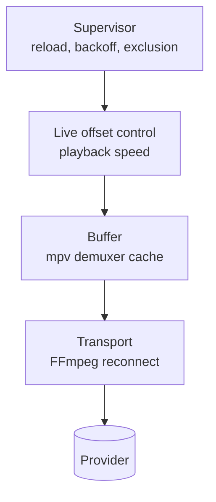

# Live Playback Design

## Context

Coax plays live IPTV from a provider whose streams stall intermittently. Three
distinct concerns hide behind "make playback reliable", and conflating them
produces a player that is either fragile or needlessly far behind live:

1. **Absorb jitter** — a short network stall should not reach the screen.
2. **Recover from loss** — a dropped connection should re-establish itself.
3. **Hold latency** — drift away from the live edge should be corrected, not
   accumulated.

ExoPlayer separates all three, and is the reference this design follows.

## Constraints

- **libmpv is the playback engine.** There are no per-segment load hooks. Fine
  grained retry belongs to FFmpeg beneath mpv; anything coarser belongs to
  Coax above it. Nothing can be inserted in between.
- **Raw TS carries no manifest.** Unlike HLS or DASH, a `.ts` live stream never
  states where the live edge is, so true live offset is not observable.
- **Raw TS is not seekable.** Latency cannot be corrected by seeking. Playback
  rate is the only control surface.
- **The engine is opaque.** Coax observes mpv properties and issues commands;
  it cannot see inside demuxing or decoding.

## Design

Four layers, each handling failures the layer below could not.



### Transport recovery

FFmpeg's HTTP layer can reconnect beneath mpv, re-establishing a dropped TCP
connection without the file ever ending. It is the only layer that can recover
without a visible interruption — and it is **disabled by default here**,
because on this stream type the cure is worse than the disease.

FFmpeg reconnects by re-opening the URL and resuming at a byte offset. A live
TS stream is not seekable, so no correct resume point exists: the server
answers from the head of its own buffer and playback replays content it has
already shown. Observed symptom is video repeating a section indefinitely.

The failure is invisible to every signal Coax watches. Reconnection happens
below mpv, so the demuxer cache never drains, `paused-for-cache` never fires,
and no rebuffer is recorded. A silent log and healthy cache metrics accompany
visibly broken playback.

`reconnect_streamed=1` is the specific option to avoid: it exists precisely to
force reconnection of non-seekable streams, which is the case that cannot
resume correctly.

`PlayerConfig::transport_reconnect` re-enables a reduced set — `reconnect`,
`reconnect_on_network_error`, `reconnect_delay_max` — so the approach stays
comparable against a real provider. For this stream type the supervisor
reloading at the live edge is the correct recovery mechanism instead.

### Buffer

Capacity and latency are **separate concerns**. The cache determines how large
a stall can be absorbed; it does not determine how far behind live playback
sits. ExoPlayer draws the same line between `DefaultLoadControl`'s 50s buffer
and its much smaller target live offset.

| Concern | Setting |
|---|---|
| Capacity | `demuxer-readahead-secs=50`, `demuxer-max-bytes=400MiB` |
| Resume threshold after a rebuffer | `cache-pause-wait=2` |
| Behaviour on a dry cache | `cache-pause=yes`, `cache-pause-initial=yes` |

Pausing to refill beats stuttering through an empty cache, and matches
ExoPlayer's `BUFFER_FOR_PLAYBACK_AFTER_REBUFFER_MS` of 2000.

### Live offset control

A proportional controller holds playback a target distance behind the live
edge by nudging playback speed. It is a port of ExoPlayer's
`DefaultLivePlaybackSpeedControl`, implemented in
[live_sync.hpp](../../src/player/live_sync.hpp).

```
error = buffered - target
speed = clamp(1.0 + 0.1 * error, 0.97, 1.03)
```

with a ±20ms deadband holding speed at exactly 1.0, and updates rate-limited to
once per second. Each rebuffer concedes 500ms of target offset, bounded at 30s.

This is what stops conceded latency from ratcheting. Without it, every stall
pushes playback further behind live permanently, because a non-seekable stream
offers no way back. With it, playback runs up to 3% fast — inaudible, with
pitch correction on — until it has caught up.

`LiveSync` is free of Windows, mpv and UI types: the control law is testable in
isolation and portable to another platform unchanged.

#### The proxy, and why it is one

ExoPlayer knows the true live offset because HLS and DASH manifests state it.
Coax has no manifest for a `.ts` stream, so the controller uses the demuxer's
buffered duration as a stand-in. The two track each other in practice — both
grow when playback falls behind — but they are not the same quantity, and the
estimate will drift where a manifest-driven one would not.

This is accepted rather than hidden. The diagnostics overlay states that the
offset is estimated, and never presents it as measured. Where a provider offers
`.m3u8` for a channel, a manifest-driven offset would be strictly better.

### Supervisor

**STUB — specified, not implemented.**

Handles what transport recovery cannot: an exhausted reconnect budget, a
persistently failing channel, a stream that ends. Its shape, following
`DefaultLoadErrorHandlingPolicy`:

- Reload the channel on terminal failure, with backoff `min((n-1) * 1s, 5s)`.
- Give up after 3 attempts and surface the failure rather than looping.
- Treat 403, 404, 410, 416, 500 and 503 as **exclusion** rather than retry: a
  channel the provider has withdrawn should be marked bad, not hammered.
- Recreate the libmpv instance when bounded recovery fails, without restarting
  the UI.

### Cross-cutting: generations

Every load intent carries a monotonically increasing generation. A reload,
retry or recovery action belonging to a superseded generation is discarded.
Without this, a slow retry can resurrect a channel the viewer has already left
— the failure mode that makes rapid channel changing feel broken.

**STUB** — required by the supervisor; not yet present.

## Trade-offs

**Latency for stability.** Each rebuffer concedes 500ms. On a persistently bad
channel the controller settles further behind live rather than fighting a
losing battle, up to the 30s ceiling. For live sport this is a real cost — a
phone notification can arrive before the picture — which is why the increment
is small and the controller actively claws it back.

**Buffer memory for absorption.** A 400MiB cache ceiling is generous, chosen so
4K HEVC has room. It is a ceiling, not an allocation.

**Learned latency is discarded on channel change.** The controller resets per
channel. Latency learned on a bad channel says nothing about the next one, and
carrying it over would penalise good channels for their neighbours.

## Alternatives considered

**Per-channel learned buffer, growing by a fixed amount per interruption, with
decay.** Rejected: the speed controller subsumes it. A controller that actively
converges is principled where a grow-and-decay heuristic needs two arbitrary
constants and still cannot recover latency on a non-seekable stream.

**Larger fixed buffer for everything.** Rejected: penalises every channel for
the worst one, and adds latency that nothing ever removes.

**Replacing the engine.** libVLC exposes D3D11 output callbacks that let the
host own the device, which is architecturally cleaner for composition. Rejected
for playback reasons: mpv's tuning surface and quality path are why this
project exists.

## Risks

| Risk | Mitigation |
|---|---|
| Buffered duration is a poor proxy for live offset on some providers | Controller is deadbanded and rate-limited; diagnostics state the offset is estimated |
| Speed changes become audible | Pitch correction enabled; range capped at ±3%, matching ExoPlayer's default |
| Reconnect options silently rejected by a future libmpv | The wrapper logs every rejected option at startup |
| Controller fights a stall instead of riding it out | Held at 1.0 whenever `paused-for-cache` or `core-idle` is set |
