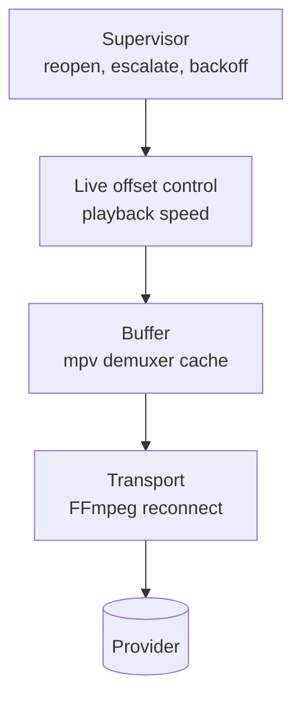

# Live Playback Design

## Context

Coax plays live IPTV from a provider whose streams stall intermittently. Three
distinct concerns hide behind "make playback reliable", and conflating them
produces a player that is either fragile or needlessly far behind live:

1. **Absorb jitter** — a short network stall should not reach the screen.
2. **Restore forward playback** — when a direct live source stops, abandon the
   failed load and rejoin the provider's current output quickly.
3. **Hold latency** — drift away from the live edge should be corrected, not
   accumulated.

ExoPlayer separates all three for adaptive live streams, and is the reference
for the parts its media model can support. Its live-offset controller does not
apply to progressive live streams, which have no live window and only one
playable position. Coax therefore does not claim adaptive-live parity for the
provider's direct TS endpoint.

For the provider's continuous progressive MPEG-TS endpoint, restoring playback
is not the same as recovering every missing second. There is no addressable live
window, segment sequence or DVR contract from which Coax can request an omitted
interval. If the provider has moved on, those pictures are unavailable to this
client. The operational success condition is therefore the first healthy,
forward-moving frame from a fresh request at the provider's current position,
not gap-free reconstruction of the failed load.

## Constraints

- **libmpv is the playback engine.** The current wrapper exposes no per-segment
  load hooks. Fine-grained retry therefore belongs to FFmpeg beneath mpv;
  anything coarser belongs to Coax above it. libmpv does have an unstable
  custom-stream callback API, so inserting a Coax-owned transport is possible,
  but it would be a substantial replacement for the current URL-loading path.
- **The provider's continuous TS endpoint carries no manifest.** Unlike HLS or
  DASH, it does not state where the live edge is, so true live offset is not
  observable. Nor can a reopen promise to backfill a missing interval; it can
  only consume the bytes the provider returns to the new request. This is a
  property of the endpoint, not every MPEG-TS resource.
- **The provider's continuous TS endpoint is not seekable.** Latency cannot be
  corrected by seeking outside mpv's local cache. Playback rate is the current
  non-disruptive control surface.
- **The engine is mostly opaque.** Coax observes mpv properties, structured
  events and selected warning logs, then issues commands; it does not inspect
  demuxer or decoder internals directly.

## Design

Four layers, each handling failures the layer below could not.



### Transport recovery

When mpv uses FFmpeg's network backend, FFmpeg's HTTP layer can reconnect
beneath mpv, re-establishing a dropped TCP connection without the file ever
ending. It is the only configured layer that could recover without a visible
interruption — and it is **disabled by default here**, because on this provider
stream the cure was worse than the disease. Current mpv can instead be built
with a libcurl HTTP backend, so `stream-lavf-o` must not be assumed to control
every future runtime. Coax should record `mpv-version`, `mpv-configuration` and
`ffmpeg-version` at startup and verify the active transport backend when this
experiment is enabled.

FFmpeg reconnects by re-opening the URL and attempting to resume the stream. On
the provider endpoint no correct byte resume point is exposed. In one observed
failure the viewer saw a section repeat indefinitely while the media timeline
rolled back. Coax's log did not observe HTTP headers, Range requests or byte
identity, so it cannot prove whether the provider, an intermediate cache or the
HTTP stack returned earlier bytes. This is provider-specific field evidence,
not a universal property of every TS server.

That observed failure was invisible to the signals Coax watched: reconnection
happened below mpv, the demuxer cache did not drain, `paused-for-cache` did not
fire, and no rebuffer was recorded. A silent log and apparently healthy cache
metrics accompanied visibly broken playback. These observations should be
revalidated when the provider or pinned FFmpeg runtime changes.

`reconnect_streamed=1` is the specific option to avoid for the observed
provider: FFmpeg documents it as enabling reconnection for streamed/non-seekable
inputs, which is exactly the path that produced unsafe replay here. It is not a
universal rule for all non-seekable servers.

`PlayerConfig::transport_reconnect` re-enables a reduced set — `reconnect`,
`reconnect_on_network_error`, `reconnect_delay_max` — so the approach stays
comparable against a real provider. Without `reconnect_streamed`, that set may
not recover a mid-stream error on a non-seekable source; it is an experiment,
not a second guaranteed recovery path. For this provider the supervisor opening
a fresh request is the preferred recovery mechanism.

That fresh request is deliberately a **rejoin**, not a byte-resume strategy.
Coax accepts a visible gap when the alternative is waiting for content the
endpoint cannot address. This matches Media3's fundamental distinction: an
adaptive live source has a live window that can be sought, whereas a progressive
live source has no live window and can be played only at the position supplied
by the source. Coax's `loadfile replace` is analogous to preparing the source
again at the application-policy level; it is not a claim that libmpv and
Media3's loader have identical internals.

### Buffer

Capacity and latency are **different but coupled concerns**. The cache ceiling
and readahead limit determine how much jitter can be absorbed, while live-offset
control decides whether accumulated delay is retained. On a live source,
however, initial fill, refill waits and server-side burst delivery can directly
add latency. ExoPlayer likewise separates load control from live-speed control,
but that separation does not make the two independent.

| Concern | Setting |
|---|---|
| Zap target (each new load) | `cache-secs=1`, `demuxer-readahead-secs=1` |
| Steady target (after five healthy seconds) | `cache-secs=10`, `demuxer-readahead-secs=10` |
| Capacity ceiling | `demuxer-max-bytes=64MiB` |
| Back-buffer ceiling | `demuxer-max-back-bytes=16MiB` |
| Resume threshold after a rebuffer | `cache-pause-wait=2` |
| Behaviour on a dry cache | `cache-pause=yes`, `cache-pause-initial=yes` |

Pausing to refill beats stuttering through an empty cache. The two-second value
matches ExoPlayer's `BUFFER_FOR_PLAYBACK_AFTER_REBUFFER_MS` of 2000, but the
semantics differ: Media3 explicitly defines a rebuffer as depletion after
playback and excludes initial buffering and seeking. In the exact mpv source
commit pinned by Coax, `cache-pause-initial` enables the shared low-cache path
before playback has started, and that path compares buffered duration with
`cache-pause-wait`. Initial fill and later underruns therefore publish the same
`paused-for-cache` state, although the later-underrun path has additional
underrun conditions. Coax must distinguish those phases itself.

The 64 MiB value is a chosen byte ceiling, not a phase target or an allocation.
The repository does not yet contain measurements that establish it as an
optimal value. It is set when libmpv is created and never rewritten during a
load. The two time targets are
reasserted at one second for every load because a preceding steady load may
have widened them. They are changed to ten seconds once per load, only for the
active generation. Both asynchronous property-command results are observed and
reported in diagnostics. The phase names the intended per-load policy, while a
separate command state remains pending until both succeed and becomes explicitly
failed if either is rejected; a partial command is never reported as confirmed.

The table above documents policy, but its values do not have one home each.
Three patterns are in use, and only one of them is right.

**Single-homed, and the pattern to follow.** The steady targets are written once:
`buffer_phase_targets(BufferPhase::Steady)` in `policy.hpp` is the only place ten
seconds appears, and the adapter reads it rather than restating it.

**Written twice.** `buffer_phase_targets(BufferPhase::Zap)` declares one second,
and `mpv_player.cpp` separately passes `"1"` for both `cache-secs` and
`demuxer-readahead-secs` when libmpv is created. Changing the policy would leave
mpv created at the old value until the first `apply_buffer_phase` overwrote it,
so the two can disagree for the whole window before the first load.

**A constant nothing reads.** `core::kDemuxerMaxBytes` declares 64 MiB in
`policy.hpp` while `mpv_player.cpp` passes the literal `"64MiB"`. The core test
pins the declared constant but cannot observe the applied literal, which makes
the coverage boundary misleading rather than absent.

**No policy home at all.** `cache-pause-wait=2` is documented here and reasoned
about against ExoPlayer's 2000 ms, but exists only as a string in the adapter.
`demuxer-max-back-bytes=16MiB` is a memory-policy value the measurement section
below already expects to read back, and it is not in `policy.hpp` either.

Every one of these agrees with its documented value today, so none is a current
runtime mismatch. The cost is drift risk, and a test surface that reads as
stronger than it is.

One fix covers them all: every tuning value in the table gets exactly one
definition in `policy.hpp`, and the adapter serialises those definitions into
mpv option values instead of repeating them. `cache-pause` and
`cache-pause-initial` are behavioural switches rather than tuning values and can
stay as they are. Where initialisation grows, build the option set in a small
function returning name/value pairs and assert on the result, which needs no
live mpv. The option-set builder belongs in the player layer. Numeric byte
counts and durations remain vendor-neutral policy in `policy.hpp`; only mpv
option names such as `demuxer-max-bytes` stay out of `coax_core`. The portable
half of `coax_player` is the right home for that mapping. That half now exists
as `coax_player_core` and is covered by CI, so this work no longer has to carry
the target split with it — the option-set builder has somewhere to live and
somewhere to be tested.

Socket timing and probing remain separate from buffer policy. Coax does not set
`network-timeout`, `demuxer-lavf-analyzeduration`, or
`demuxer-lavf-probesize` in the default configuration. Provider MPEG-TS can
need a complete PMT before tracks appear, and prolonged silence is classified
by the multi-signal health fold rather than a per-file socket deadline.

### Live offset control

A proportional controller attempts to hold playback a target buffered duration
by nudging playback speed. It is a reduced controller inspired by ExoPlayer's
`DefaultLivePlaybackSpeedControl`, implemented in
[live_sync.hpp](../../src/player/live_sync.hpp).

```text
error = buffered - target
speed = clamp(1.0 + 0.1 * error, 0.97, 1.03)
```

with a ±20ms deadband holding speed at exactly 1.0, and updates rate-limited to
once per second. Each rebuffer concedes 500ms of target offset, bounded at 30s.

The controller can remove buffered duration above its current target by running
up to 3% fast. Pitch correction is enabled, which reduces pitch changes, but
whether a 3% tempo change or correction artifacts are audible is content- and
listener-dependent and still needs listening tests.

The 500ms concessions intentionally **ratchet**: `notify_rebuffer()` raises the
target and nothing decays it toward the initial target. The controller claws
back only excess above the newly raised target. Coax will not add target decay
for the provider's direct progressive TS endpoint. ExoPlayer's adaptive target
uses an observable live window; Media3 explicitly excludes progressive live
streams from that model. Applying equivalent decay to `demuxer-cache-duration`
would invent a live edge from an unreliable proxy rather than reproduce
ExoPlayer behavior. A channel change or player recreation remains the reset.

Revisit this decision only if representative long sessions demonstrate
unacceptable accumulated latency. Any replacement policy must first establish
a trustworthy observable, bounded behavior and user-experience evidence; the
mere passage of stable playback time is not proof that a direct TS stream has
returned closer to live.

`LiveSync` is free of Windows, mpv and UI types, so the control law is testable
in isolation and portable to another platform. It is now built into
`coax_player_core` and has a direct test suite that CI runs. The gating around
it — what a turn may learn from mpv's cache signalling — is `LiveSyncGate` and
is tested with it. `PlaybackSession` is the production coordinator that feeds
the gate and controller in application order, and the portable integration
suite drives that same object through stall entry, repeated stalled turns and
immediate correction on exit. The remaining gap is field exercise against a
real provider/mpv stall, not a second copy of the application wiring.

#### The proxy, and why it is one

ExoPlayer can expose a current live offset when its media timeline provides
enough wall-clock and live-window information; Android documents that value as
"if available", not guaranteed for every HLS or DASH stream. A manifest alone
does not necessarily establish true wall-clock latency. Coax has no manifest
for the provider's TS stream, so the controller uses mpv's
`demuxer-cache-duration` as a stand-in. mpv documents that property as an
approximate, very unreliable guess that is often unavailable even when data is
buffered. Buffered duration and live offset may move together, but they are not
the same quantity and the estimate can drift or disappear.

The diagnostics overlay states that the offset is estimated and does not
present it as measured. Where a provider offers `.m3u8` with usable live-window
timing, a manifest-derived offset can be better, but Coax does not currently
extract one: HLS would still feed demuxer buffered duration to this controller.

#### Known live-sync correctness gaps

All three original defects recorded here are fixed. The second took three
attempts, and both failed ones are recorded in full: each passed its isolated
tests and was then falsified by the running application, so the engine behaviour
and the two wrong readings of it are all easy to reintroduce.

1. **Fixed.** When `demuxer-cache-duration` was unavailable, the adapter
   preserved an optional value for health but separately converted it to `0.0`
   for `LiveSync`. Against a positive target that installs `0.97x`, which adds
   roughly 108 seconds of latency per hour for as long as telemetry stays
   unavailable. The adapter no longer keeps a flattened copy — the optional is
   the only reading — and an absent measurement now holds `1.0x` and runs no
   controller update until a valid one arrives. A real `0.0` is still a
   measurement and is still controlled on. The diagnostics overlay distinguishes
   the two rather than reporting `0.0s` for both.
2. **Fixed, after two falsified attempts.** `cache-pause-initial=yes` makes mpv
   enter the same `paused-for-cache` state used for an actual underrun, and no
   reading taken close to playback start separates the two.

   The first attempt, at `5388982`, rejected a pause while `first_frame_seen`
   was false. The application defeats it by collapsing both signals into one
   turn: `process_player_events` sets the flag before `update_live_sync` reads
   the pause state, and the initial-fill edge commonly coincides with playback
   start, so the gate sees `paused=true, first_frame_seen=true` and charges
   500ms. Of 18 user-requested generations in the 2026-08-07 session, 16
   eventually logged `Rebuffer #1`; 15 logged it within one millisecond of first
   frame. Generations 4 and 12 logged no `#1`, and generation 18 was the sole
   later edge, 10.36 seconds after first frame. Generation 17's recovery load
   separately charged `Rebuffer #6` in the same millisecond as its recovered
   first frame. Reordering the two calls cannot separate signals that arrive in
   the same application turn.

   The second attempt followed from that evidence: stay disarmed until a
   post-first-frame, non-paused observation establishes playback. A 2026-08-08
   run against a live HLS source falsified it with the fix in the shipped
   binary. mpv releases `paused-for-cache` for a single frame turn as the
   picture comes up and re-enters the opening fill about a millisecond later.
   That first turn arms, the second is a rising edge against an armed gate, and
   `Rebuffer #1` still landed one millisecond after `first-frame`. A momentary
   unpause is not established playback, and a dwell threshold picked to survive
   one observation would not be evidence-backed.

   The gate now concedes only on a pause edge taken while the supervisor has
   confirmed the load steady: a first frame followed by the five-second
   `steady_healthy_window`. That is the application's existing definition of
   playback having actually started, it is the same standard the supervisor
   already applies before clearing a recovery attempt count — a first frame by
   itself is not evidence — and an opening fill cannot manufacture it. Hanging
   arming off `Steady` also exposed that the reducer was not enforcing that
   standard; see the Supervisor section for the deadline defect this found and
   closed, without which this fix would have inherited it. The
   signal is per load. `App::begin_health_load()` clears it on user loads and on
   every recovery reopen, while `LiveSyncGate::reset()` deliberately does not
   run on ordinary reopens because `was_paused_for_cache_` and learned
   controller state are meant to survive an episode. Those are opposite
   lifetimes and are kept as separate flags with separate entry points.

   The cost is deliberate: a genuine underrun inside a load's first five seconds
   concedes nothing. That window is already treated as opening the channel
   rather than playing it, non-progress in it already reaches the supervisor as
   a stall, and under-charging there is the safe direction for a defect whose
   entire history is over-charging.
3. **Fixed.** While `paused-for-cache` or `core-idle` is true, the gate requests
   `1.0x` and rejects cache duration as controller input. `LiveSync` installs
   unity only when a correction is active and invalidates its update interval,
   so repeated stalled turns do not churn mpv and the first valid normal-
   playback sample recomputes immediately. This is a safety invariant: stalled
   telemetry is not valid control input. It does not decay or otherwise change
   the learned target.

Both rules live in `player::LiveSyncGate`, beside the controller they guard
rather than inside `App`'s frame tick. The gate stayed correct in isolation
through both falsified attempts, which is the lesson: the defect was never in
the rule, it was in what the application handed the rule and when.

`player::LiveSyncTurn` owns that assembly — the per-load flags, the generation-
filtered event drain, and construction of the sample from `Diagnostics` —
inside `player::PlaybackSession`. `App` drains mpv events into
`PlaybackSession::service_turn()`, and the portable recovery fixture wraps that
same production coordinator with fake telemetry and typed player actions. The
event → cache level → health fold → supervisor poll → live-sync sequence is
therefore no longer copied into a test fixture. That is what the earlier cases
lacked: they supplied a pre-first-frame paused observation the runtime usually
did not produce, and `a recovery reopen concedes nothing before its own first
frame` fed `buffering(false)` around the reopen and passed while asserting the
exact behavior generation 17 falsified. Concrete mpv command execution remains
in `App`, but its success or failure is synchronously returned to the session,
which always settles the supervisor effect.

### Supervisor

The portable supervisor handles failures that buffer absorption cannot. Its
pure reducer consumes generation-scoped events and injected monotonic time; a
host owns one deadline re-derived from the latest state. The fixed retry
schedule is `[500, 1000, 2000, 4000, 5000]` milliseconds, with a 30-second
wall-clock budget for the whole recovery episode. The attempt count clears only
after the recovered load produces a first frame and then remains healthy for
five seconds. A first frame by itself is not recovery evidence.

Until 2026-08-08 that last sentence was a claim the reducer did not enforce. A
first frame armed the five-second deadline, and the fold's `interrupted` signal
was the only thing that restarted it — but that signal is a
healthy-to-degraded *transition*. A `paused-for-cache` fill that began before
first frame was already degraded when the window was armed and produced no
later edge. The deadline then expired mid-fill and confirmed `Steady` while the
cache was still holding playback back.

The cache-specific repair added three rules. The deadline cannot confirm
`Steady` while `cache_paused` is set; it restarts instead. Entering a cache pause
in Zap restarts the window because it interrupts the evidence being counted.
Leaving one restarts it too, because that is where clean playback actually
begins — without that rule a held deadline carries credit for time spent
filling, so a fill clearing just before it expires confirms almost immediately
and the oscillation at the end of that same fill is charged as a rebuffer.

That repair exposed the same edge-versus-level defect outside cache pauses. A
decode degradation can produce one interruption edge, remain unhealthy, and
then silently outlive the restarted window. Worse, the five-second deadline is
shorter than the six-second decode-stall threshold: `Steady` could clear a
recovery attempt immediately before the continuing degradation triggered the
next recovery, laundering attempt two back into attempt one.

The supervisor therefore stores the last *determinate* health level as
`PlaybackHealthObserved`, not only its transition. Both determinate edges
restart an armed window: becoming unhealthy invalidates the elapsed evidence,
and becoming healthy starts a new clean interval. At the deadline, a retained
unhealthy level holds and restarts the window even when there has been no
further edge. Repeated same-level observations do not restart anything, or
periodic good news would prevent a healthy load from ever confirming.

`Unknown` is deliberately neutral. It means playback-time evidence was absent,
so `App` publishes no new level: it cannot manufacture an unhealthy condition,
and it cannot clear one already observed. A new load starts neutral, preserving
the old `is_unhealthy()` boundary when playback time is unavailable throughout.
This avoids repeating the missing-cache-duration defect in the opposite
direction by converting absent telemetry into a definite `false` health level.

Confirmation now means five seconds without an observed unhealthy condition at
the health sampler's 500ms resolution, timed from the latest cache-state or
determinate health-level edge. Cache state is still published every turn because
brief mpv pause oscillations occur far below that resolution. `App` publishes a
due determinate health sample and then polls, so a deadline sees the latest
known verdict; cache state is dispatched immediately before both, so the
supervisor and live-sync gate read the same pause state within a turn.

All of this was found because live-sync arming was hung off `Steady` and
inherited the bug; `apply_buffer_phase(Steady)` was also switching to steady
buffer targets mid-fill.

The consequence is that a load which never manages five seconds without an
observed unhealthy condition or fill never confirms, so it never clears an
attempt count, never moves to steady buffer targets, and never concedes live
latency. For a channel in that state the supervisor's stall detection and
recovery are the relevant machinery, not a 500ms target nudge — but it does mean
the rebuffer concession cannot help a channel that has never once played
cleanly. The documented direct-TS policy intentionally leaves this to bounded
recovery rather than adding speculative target decay.

The base schedule is truncated exponential backoff, but it is deterministic.
Network retry guidance recommends adding jitter so many clients do not retry a
broadcast outage in lockstep, retrying only idempotent requests after plausibly
transient failures, and honoring `Retry-After` where the transport exposes it.
Fresh stream GETs are idempotent at the HTTP layer, but classification still
needs transport and request context: timeouts, disconnects, 408, 429 and 5xx
responses are normally retry candidates; known credential or configuration
failures are not. HTTP status alone cannot provide every distinction. RFC 9110
allows a 403 for reasons unrelated to credentials and says a 404 does not reveal
whether absence is temporary or permanent. A future context-aware classifier
should treat failure of a just-advertised HLS segment as transient within the
combined demuxer/supervisor error budget. A missing initial channel endpoint can
be terminal only when the request role or provider contract establishes that
meaning; unknown cases retain bounded generic recovery.

The host queues emitted effects and drains them from the outermost dispatch
frame. A synchronous load result therefore becomes a later reducer event rather
than re-entering the reducer or duplicating state-change callbacks.

Continuous MPEG-TS recovery reopens the resolved stream. An HLS recovery branch
performs a fresh replace load using `live_start_index=-1`, which selects the
last advertised segment. That is **not standards-aligned normal HLS startup**:
RFC 8216 says a client should not choose a segment starting less than three
target durations from the playlist end because doing so can trigger stalls.
FFmpeg's longstanding default is `-3`, and `prefer_x_start=1` can honor a
provider's `EXT-X-START`. Segment count is only an approximation of target
duration, so the preferred policy is to honor a valid server start point and
otherwise retain a conservative demuxer default unless provider measurements
justify something closer to the edge.

The branch also disables persistent and multiple HTTP connections, even though
FFmpeg enables both by default. Those are connection/performance controls, not
retry controls, and should remain at upstream defaults unless a reproducible
provider fault justifies overriding them. `seg_max_retry=0` is already FFmpeg's
default. These settings do **not** disable all playlist error handling:
`max_reload` and `m3u8_hold_counters` remain at FFmpeg defaults.

Normal HLS playlist refresh must not be disabled: RFC 8216 requires clients to
reload a live Media Playlist periodically. The architectural goal should be to
leave normal refresh and prefetch inside the demuxer while bounding error retry
and surfacing exhaustion to the supervisor, with one documented total budget
across both layers.

The HLS branch is implemented and reducer-tested but currently unreachable in
the application: both Xtream and direct-media loads are unconditionally tagged
as MPEG-TS. Before claiming HLS support, transport selection and an integration
test must make that branch reachable.

Each fresh or recovery command now has a monotonic load-attempt identity within
its generation. A TS recovery episode stays open through first frame and closes
only after five continuously clean seconds. If two source-reopened loads stall
or end before that probation completes, the next attempt recreates libmpv once
in process. Recreation and every later source reopen retain the episode's
original start, attempt count and 30-second wall-clock budget; the due-time check
also prevents a delayed UI poll from issuing a command after the deadline.
Exhaustion enters the existing explicit Failed state and emits no later
recovery command.

There are two deliberately narrow late-first-frame paths. If the exact current
load starts while an opening-stall source reopen is still waiting in backoff,
and no replacement command has been issued, the supervisor cancels that retry
and enters Zap probation. The attempt count, episode start and budget remain;
the frame alone is not success. A backend, IPC or presentation fault upgrades
or retains player recreation and cannot be cancelled by a frame.

If command exhaustion reaches `Failed` while the exact current opening-stalled
load is still running, that one load receives one command-free admission to Zap
probation when its first frame arrives. Generation and load-attempt fencing both
have to match. The application restarts the health fold and cache supervision
at that transition. A failure before clean probation returns to `Failed` with
no effect and consumes the admission, preventing a Failed/revival/retry loop;
five clean seconds return to `Steady` and reset the episode normally. A stale,
replaced, ended, backend-dead or recreation-required load cannot use the path.

Telemetry follows the episode rather than historical load intent. A fault is
`renewed-stall` or `renewed-eof` only while recovery/probation is active. Clean
probation clears episode-local first-frame time, so a later fault is
`fault-decided`; recovered-load lifetime remains separately measurable from
the load command. Both late paths emit `late-first-frame`, scoped to the opaque
provider/channel session, generation and load-attempt identifiers.

Before first frame, the existing eight-second open-stall confirmation is a hard
time-to-picture bound. Input delivery, cache growth and a readable or moving
playback timestamp remain useful diagnostics, but none proves that mpv can
present the load. The health fold therefore holds `OpenStalled` throughout the
pre-frame phase and emits the recovery signal only after both the duration and
minimum-observation requirements are met. A genuinely slow load can still start
during retry backoff or after command exhaustion through the narrow late-frame
paths above; packet activity alone cannot park Zap indefinitely.

`paused-for-cache=yes` is initially classified as ordinary cache buffering and
accrues neither the short unpaused progress-stall clock nor the long
decode-stall clock. After first frame it instead owns a separate ten-second
grace clock while readable playback makes no meaningful forward progress.
Meaningful progress, missing progress evidence or pause exit resets that clock;
expiry emits the distinct `cache-stall` reason into the same bounded
source-reopen path. Backward timestamp movement remains signed diagnostic
evidence: an isolated movement does not itself enter recovery. Active
unexpected live EOF and confirmed unpaused no-progress also use the bounded
source-reopen path.

Requiring readable playback time is deliberately conservative: missing
telemetry cannot be reinterpreted as zero movement. It also leaves a known
limit—if a harder freeze stops playback-time observations while
`paused-for-cache` remains set, this particular clock resets and cannot bound
the freeze. The 1h58m soak had no missing-evidence sample in any paused run, so
it neither reproduced nor ruled out that shape. A follow-up field run should
record whether it occurs before a separate missing-telemetry policy is added.

A classified format-probe failure spends one normal attempt on a reopen with an
explicit demuxer format. Exact HTTP 401 log patterns are terminal authentication
failures. The current classifier intentionally does not classify a 403 or a
status-only 404 as terminal. If mpv subsequently emits a structured end, the
application dispatches a generic `StreamEnded` after its log-correlation window,
and the failure consumes the normal attempt schedule and wall-clock budget; it
is not retried indefinitely. HLS segment-specific failure wording can instead
be classified as `HlsSegmentUnavailable`. An unavailable recovery target or
rejected local load effect is terminal as `SourceUnavailable`.

A libmpv shutdown or event-queue failure emits one `recreate-player` effect.
That effect destroys and initializes the in-process libmpv owner, then reloads
the same generation, transport, and active forced-probe mode; the HWND, UI, and
process remain alive. The same five-attempt schedule and nominal 30-second
budget bound recreation. The budget is checked when scheduling the next
attempt and again when it becomes due, so a delayed UI poll cannot start an
overdue command after 30 seconds. A stale effect cannot replace a newer channel
because the player checks the generation and load-attempt identity before
acting and the reducer drops every mismatched outcome.

Playback health is a separate pure fold sampled every 500 ms. It requires
agreement between playback progress, cache depletion, and input advance across
multiple observations. Open stalls confirm after eight seconds, progress
stalls after one second and at least three observations, and decode stalls
after six seconds and at least eight observations. A single mpv level never
starts recovery. Timeline discontinuities compare media movement with elapsed
monotonic time:

```text
abs((currentPlayback - previousPlayback) - elapsed) > 1 second
```

The fold now retains the inputs to that comparison before applying `abs()`.
`BufferHealthSnapshot::timeline` is reset for every load and carries the load
generation. Its optional measurements use seconds and these conventions:

| Field | Definition and sign |
|---|---|
| `elapsed_seconds` | Nonnegative monotonic time from the previous health sample to this one |
| `playback_movement_seconds` | `current playback-time - previous playback-time`; positive advances, zero stops and negative moves backward |
| `playback_deviation_seconds` | `playback_movement_seconds - elapsed_seconds`; positive is ahead of wall-clock expectation and negative is behind, including a backward reset |
| `cache_end_movement_seconds` | `current demuxer-cache-end - previous demuxer-cache-end`; positive extends the reported cache end and negative moves it backward |
| `control_playback_movement_seconds` | The same signed movement from the health fold's last readable playback baseline; normally identical to adjacent movement |
| `control_playback_deviation_seconds` | Control movement minus elapsed; this is the signed value to which the existing discontinuity threshold is applied |
| `control_baseline_retained` | True when missing telemetry made the health fold use its retained readable baseline, false for an adjacent baseline and unavailable when no comparison exists |

Movement and deviation are unavailable unless both adjacent playback-time
samples exist; cache-end movement is unavailable unless both adjacent
cache-end samples exist. A missing endpoint never becomes zero. The existing
nonnegative `input_realtime_ratio` remains a separate derived control input, so
clamping that ratio no longer destroys the signed cache evidence. A generation
mismatch rejects the complete observation before it can alter the current
load's snapshot. Separate control baselines still retain the last usable
playback/cache values across an unreadable sample, preserving the pre-existing
health verdict and stall behavior; the raw evidence never borrows those values.
Both forms are logged, so a discontinuity after missing telemetry no longer
reports only `kind=unavailable`: it also identifies the retained baseline and
the signed control deviation that triggered the warning.

The portable player layer presents the evidence as `normal-advance`,
`forward-jump`, `forward-lag`, `backward`, `no-progress`,
`paused-no-progress` or `resume-lag`. The last two use current and previous
`paused-for-cache` levels; they are presentation categories, not recovery
policy. Classification consumes the exact `HealthPolicy` used for that fold;
it has no independent default. `forward-lag` and `resume-lag` mean a negative
deviation beyond the one-second discontinuity threshold. At the scheduled
500ms cadence they therefore normally require a delayed application turn and
must not be read as generic sub-threshold stream lag; the signed deviation is
the primary observation. The F1 diagnostics panel shows the raw values and
category. The session log writes a generation-scoped debug line for every
health sample and a warning line for each existing discontinuity, including
signed movements, pause context, the active-entry and unattributed engine-message
counts since the preceding sample, and the most recent active-entry diagnostic's
sanitized severity/component/category. The generation printed on those lines
comes from the evidence snapshot itself rather than being looked up again from
the current target.

Forward discontinuities that still make progress can be diagnostic only. A
backward or no-progress discontinuity can classify the sample as degraded,
publish an unhealthy level, restart or hold the steady window while still in
Zap and, if degradation continues, contribute to decode-stall recovery. The
health discontinuity counter resets per load and remains distinct from the
number of `MPV_EVENT_PLAYBACK_RESTART` edges reported by mpv.

#### P1: rapid return to current live playback

This hierarchy is implemented and test-covered for continuous progressive TS,
with follow-up field acceptance still pending. It optimizes for **time to the
next healthy current-live frame**, not for recovery of content the provider no
longer exposes:

1. Keep playing through an isolated timestamp reset while signed playback keeps
   making forward progress. Record it, but do not reopen on discontinuity alone.
2. Give an ordinary `paused-for-cache=yes` underrun ten seconds of grace while
   playback makes no meaningful forward progress, so the configured buffer can
   absorb jitter. Reset that grace on progress or pause exit; a cache pause is
   not by itself a dead source.
3. When playback is unpaused but makes no progress for the confirmed health
   threshold, or when a live load ends unexpectedly, issue a fresh source
   reopen. Do not wait for a nonexistent progressive live window to supply the
   omitted interval.
4. If fresh loads repeatedly reach only a first frame and then stall or end
   before the five-second clean probation completes, escalate from source reopen
   to one full in-process player recreation.
5. Keep reopen and recreation in one bounded recovery episode. A first frame
   does not reset the attempt count, and neither repeated EOF nor recreation may
   create an infinite loop.
6. Cancel an opening-stall source retry when the exact still-current load starts
   during backoff before any replacement command. Keep it on probation in the
   same episode; never cancel recreation required by backend, IPC or presentation
   failure.
7. After command exhaustion, let only the exact current opening-stalled load
   enter one command-free probation from `Failed`. Resume supervision, return
   to `Failed` without an effect if it fails, and reset only after clean
   probation.

The cache grace is selected from the 2026-08-09 provider soak: ordinary sampled
pauses topped out at 6.0s, while the two hard freezes lasted 74.6s and 116.0s,
leaving a large evidence-backed gap around the ten-second bound. The existing
one-second/three-observation progress-stall rule, six-second decode-stall rule,
immediate unexpected-EOF path, capped retry schedule and five-second clean
probation remain the original baselines.

The later soak exercised the bounded path twice. Both generations decided a
cache stall after 10.584 seconds, open-stalled two reopens at about 8.06 seconds
each, recreated mpv exactly once and reached `Failed` / `budget-expired` after
about 27.8 seconds. The issued recreation loads then became ready after 61.21
and 26.10 seconds—about 53 and 18 seconds after `Failed`—and played without
health supervision in the old application. A separate startup load produced a
first frame inside retry backoff; ignoring it and issuing the scheduled reopen
added roughly four seconds. The corrected lifecycle is locally verified but
still needs another provider run, so Phase 1 is not complete.

The next soak confirmed ordinary cache-stall recovery and clean episode-scoped
telemetry, then exposed a data-delivering no-frame open. A generation 2 recovery
reopen reported ready after 8.00 seconds, advanced cache timestamps and produced
heavy video-decoder errors, but emitted no `FirstFrame`. Its readable playback
timestamp remained stopped, including one roughly 95,087-second cache timestamp
jump. The old fold classified the pre-frame activity as `Unknown`, leaving Zap
active for about 2m16s until a user reload. That reload produced a frame in
3.802 seconds, completed clean probation in 5.732 seconds and stayed healthy.
The opening bound now depends on first frame rather than absence of transport
activity; the eight-second baseline itself is unchanged.

A corrected-binary soak subsequently ran for about 1h25m across five
generations. Generation 5 recovered from an EOF after its first reopen produced
no frame: the shipped runtime emitted `open-stall` after 8.064 seconds, then a
second reopen produced a frame in 6.280 seconds and completed clean probation in
5.778 seconds. About 32m23s later a new EOF was correctly `fault-decided`, with
episode-local first-frame timing unavailable and the prior recovered lifetime
reported separately. Its first reopen produced a frame in 4.884 seconds and
completed probation in 5.662 seconds. Sampling remained healthy afterward; no
recreation, `Failed`, budget exhaustion, late-frame loop or credential-bearing
diagnostic occurred. The open-stalled attempt had entirely unavailable health
telemetry, so this validates the hard no-frame runtime path but does not claim
that the earlier data-delivering shape recurred.

This is aligned with Media3/ExoPlayer's strategy without copying its constants
blindly. Media3 gives adaptive streams a seekable live window and handles a
behind-live-window error by seeking to the default live position and preparing
again. A progressive live stream has no such window. Media3's default load-error
policy gives progressive live loads a minimum of six retries with an error-count delay
capped at five seconds, and a terminal playback error can be retried with
`prepare()`. It also exposes a custom load-error policy. Coax has the same broad
shape—bounded loader retry followed by application-level source preparation—but
should tune for television time-to-picture and the observed provider rather than
adopt six retries or five seconds as compatibility requirements.

Full player recreation is not part of that claimed Media3 alignment. The cited
guidance supports retrying or preparing the source again; Coax's recreation step
is a libmpv-specific containment experiment for repeated short-lived loads or
suspected wedged engine state, and its value must be established by outcome data.

P1 acceptance evidence must separate the latency components instead of reporting
one aggregate recovery time:

- last confirmed forward progress to fault decision;
- decision to `loadfile replace` or player-recreation command;
- command to first frame;
- first frame to clean probation or renewed stall/EOF;
- recovered-load lifetime, attempt number, escalation level and terminal result.

`first-frame-to-outcome` is episode-local and becomes unavailable after clean
probation. `recovered-load-lifetime` deliberately survives that boundary, so a
later fault can report how long the recovered command lived without being
mislabelled as a renewed fault.

Generation and load-attempt identifiers must accompany those measurements so a
late event from a replaced load cannot appear to prove recovery. Content
fingerprints or credential-safe wire capture are optional follow-up instruments
if users continue to report advancing pictures or audio that repeat; they are
not prerequisites for implementing fast stall/EOF recovery.

The field basis and sanitized line-level citations are recorded separately in
[the 2026-08-08 live-playback evidence report](../evidence/coax-live-playback-evidence-report.md).
Delivery sequencing from fast TS rejoin through HLS evaluation is tracked in the
[Live Transport Recovery Micro-project](live-transport-recovery-project.md).

#### Advancing replay is not a stall

A provider session captured on 2026-08-07 exposed a different failure from the
unsafe FFmpeg reconnect described under Transport recovery. The user-visible
symptom was the same short section of video repeating until the stream was
requested again. The log corroborates media-timeline discontinuities; by itself
it could not prove that the pictures repeated, and the 2026-08-08 observations
recorded below supply that link for one later instance. The application leaves
`PlayerConfig::transport_reconnect` at its `false` default, but the session log
does not record the evaluated option or active network backend.

Two automatic recoveries were observed to completion, and both were followed
by the reported replay shape:

- Generation 16 detected a progress stall, reopened, produced its first frame
  after 3.19 seconds and passed the five-second healthy window. It then recorded
  three discontinuities, separated by 3.53 and 15.12 seconds, before the user
  selected another channel.
- Generation 17 detected a progress stall, reopened and produced its first
  frame after 3.79 seconds. It passed the healthy window, then recorded two
  discontinuities 4.03 seconds apart. A user request for the same channel 24.91
  seconds after the automatic load started created generation 18. That load
  recorded six rebuffers across its first 30 minutes, no discontinuity, and no
  channel replacement before session shutdown 57 minutes after it began.

A third automatic recovery, generation 15, was replaced by a user request
before its first frame and says nothing about the recovered result. The session
also contains discontinuities without preceding recovery: generation 12 had
three and generation 3 had one. There is no matching screen observation to say
whether those were replay, legitimate MPEG-TS resets or damage. They prevent a
classifier from defining replay as exclusively post-recovery, while recovery
proximity remains useful corroborating context. The variable intervals also
rule out hard-coding the roughly four-second spacing seen in generation 17.

The evidence establishes a bad media timeline after two recoveries; it does not
attribute repeated bytes to the provider, an intermediate transport layer or
retained engine/controller state. Automatic recovery and a user channel request
both reach the same mpv `loadfile replace` command, and a generation is
ownership bookkeeping rather than a different network operation. They do have
one concrete state difference: a user request resets `LiveSync`,
`LiveSyncGate`, the displayed rebuffer count and mpv speed to `1.0x`, while
`reopen_current` resets none of them. Generation 16 retained a 5.0-second live
target. Generation 17 inherited 6.5 seconds, then falsely charged a further
0.5-second concession at its recovered first frame to reach 7.0 seconds. These
are distinct findings: the reopen retained an old target, and its own initial
fill then raised that target. With about one second buffered during Zap against
the resulting seven-second live target, the controller error is about minus six
seconds and speed clamps to the `0.97x` floor. That retained and ratcheted state
can change latency and playback rate and must be isolated experimentally, but it
does not by itself explain backwards media movement. The later user request's
success is evidence for timing or state-reset sensitivity, not proof that
incrementing the generation fixed the stream.

A second session against the same provider on 2026-08-08, captured while the
live-sync arming work was verified, supplies the screen observation the first
one lacked. The viewer confirmed repeating pictures while a `Timeline
discontinuity` line was being written, so for that instance the log signal and
the reported symptom are the same event. Three further observations each narrow
the problem differently, and none of them settles the cause:

- **Replay occurred with no preceding recovery.** Generation 2 was an ordinary
  user-requested load that reached `steady-confirmed` and recorded its first
  discontinuity 24.8 seconds later, with no recovery anywhere in the session to
  that point. Generation 5 repeated the shape 25.5 seconds after its own
  confirmation and went on to record fourteen. Recovery proximity is therefore
  not a precondition, and a classifier keyed on it would have missed both.
- **A fresh user request reproduced the same section.** The viewer reported that
  re-selecting the channel replayed content it had just shown. A user request is
  a new generation, a new `loadfile replace` and a new HTTP request, with
  `LiveSync`, the gate, the rebuffer count and speed all reset, and Coax retains
  no media. That is evidence against Coax's own orchestration holding the
  repeated bytes. It does **not** distinguish the provider, an intermediate
  cache, or the HTTP client below mpv: a client reopening with a range against a
  server-side buffer would look identical from here. The 2026-08-07 session's
  generation 18 appeared to recover on a user request, so the two sessions
  disagree and neither is decisive.
- **Replay is not confined to unstable streams.** The viewer reports the same
  symptom on otherwise stable streams. Two of the eight loads in this session
  showed it and six did not, which is sampling rather than a property of bad
  channels.

The same session demonstrated that the discontinuity counter cannot serve as a
replay signal without the signed-movement work required above. Generation 5's
second discontinuity was written 270ms after its `Rebuffer #1`: a cache pause
longer than `discontinuity_jump_seconds` makes playback lag the wall clock,
which the fold classifies as a discontinuity in the forward direction. Stalls
and backward replay are counted together today, so any threshold derived from
that counter measures both at once.

Intervals within generation 5 were 28.2, 19.7, 6.6, 2.5, 1.0, 16.6, 0.5, 4.5,
6.0, 15.6 and 4.5 seconds — bursts separated by quiet rather than a cadence,
which strengthens the existing rule against hard-coding a spacing.

One correlation is worth carrying into the next capture rather than acting on.
Sanitized warning components differ between affected and unaffected loads in a
way volume alone does not explain: generation 3 logged 301 `mpv/ffmpeg/video`
warnings and recorded no discontinuity, while generation 5 logged 24 of those
but 63 `mpv/cplayer` and 12 `mpv/ffmpeg/demuxer`. No `mpv/stream` or `mpv/http`
warning appeared anywhere in the session, which is weak evidence against a
visible transport-layer reconnection but proves nothing while the active network
backend goes unrecorded. The adapter discards message text, so the lines most
likely to name the cause are precisely the ones that cannot be read.

Together these change what a replay-specific fix should attempt. If a fresh
request can return the same section, an episode that spends five attempts
reopening may arrive at the same picture with its budget gone. Detection and
honest reporting may be the only useful automatic behaviour for a stream that
continues advancing while showing old content. The terminal invariant is still
required so a future replay policy cannot retry forever, but reopening must not
be assumed to restore unique content. Deciding that needs an observation Coax
cannot currently make: the request its stack actually sends on a fresh selection
and whether the response carries the same bytes. That requires credential-safe
wire evidence or content fingerprints, not more interpretation of timestamps.

This condition escapes the present health policy. Playback advances normally
while each repeated section is shown, so those samples are healthy and the
cache can remain fed. Only the boundary that jumps backwards is degraded. The
unhealthy level already reaches the supervisor from the fold's verdict. The
supervisor uses that level to govern confirmation only while in Zap, so it does
not recover a backward jump after `steady-confirmed`. The next advancing sample
also clears the continuous decode-degradation timer. This means a Steady-state
replay policy would be separate from the P1 health recovery above. It is not the
primary trigger for quick recovery: a backward boundary remains diagnostic
unless it causes sustained no-progress, EOF or another corroborated unhealthy
condition. If pictures genuinely repeat while timestamps and playback continue
advancing, the present telemetry cannot choose a reliable remedy.

Restarting on a count of generic discontinuities is not an acceptable fix.
Live MPEG-TS can contain legitimate timestamp resets, splices and damage. The
health fold previously reduced signed playback movement to a boolean
discontinuity and clamped the cache-end delta with `max(0, delta / elapsed)`.
The raw signed values are now retained as described above while the clamped
delivery rate remains separately available. This makes a backward cache-end
jump and a zero delivery ratio distinguishable without changing the existing
health or recovery decisions. Recovery history still needs to be correlated
with these measurements and field observations before defining any replay
threshold or replay-specific automatic action. That investigation must not
delay the reopen-first P1 for confirmed stall and EOF.

#### Warning and request observability

The pinned mpv log path still passes raw warning text directly to the exact
transport-failure classifier for the duration of one event turn, but no raw
text or raw prefix is persisted. A second portable classifier retains only a
closed severity (`warning`, `error`, `fatal` or `other`), component (`player`,
`demuxer`, video/audio decoder, `stream`, `http` or `other`) and category
(authentication, HTTP failure, timeout, HLS
playlist/segment, format probe, timestamp discontinuity, non-monotonic
timestamp, continuity error, corrupt packet, decode error or `other`). The
severity and category are logged with either active-entry generation context or
an explicit `unattributed` status. The latest active-entry summary and both
per-load message counts are also shown in diagnostics and correlated with the
next health observation. Because `MPV_EVENT_LOG_MESSAGE` carries no request or
playlist-entry identity, active-entry attribution begins only after `START_FILE`
and only when the adapter's active generation matches the current target.
Messages observed during a replacement or recovery handover remain visible in
the separate `unattributed` count and cannot enter the active load's warning
summary. Neither bucket proves which backend request produced a message; it
records the active-entry context at observation time. Every message is counted,
while only the first distinct severity/component/category triple per load and
attribution bucket writes a session-log line. Fixtures include
authenticated URLs, userinfo, query tokens and an Authorization header and
assert that none can survive in retained output. HLS keepalive roles match the
explicit pinned phrases `when parsing playlist` and `when opening url`; a
provider URL that happens to contain `playlist` cannot decide the category.

A fresh channel selection was verified in code and tests to hand libmpv this
command shape: `loadfile`, the target argument, and `replace`, with the
progressive Xtream load recorded as `transport=mpeg-ts` and no forced demuxer
format. Runtime logging deliberately replaces the target argument with only
`scheme=https|http|local-file|other`,
`target=xtream-live|hls-playlist|media-path|opaque`, and boolean
query/userinfo-presence markers. It also distinguishes `fresh-selection`,
`recovery-reopen` and `player-recreation`. No host, path, query value, URL,
credential or header value is retained.

Each successful provider connection also starts an opaque process-local
`provider-session` namespace. Normalized channel IDs are assigned sequential
`channel-session` numbers inside it. Re-selecting the same channel therefore
reuses the same pair in the log, while changing providers starts a new pair;
the registry never receives a URL, channel name or credentials. This restores
the ability to correlate generations and reopens without weakening the
explicit no-stream-URL boundary. The former stream-URL redactor and its dead
production API were removed rather than kept as an attractive way around that
boundary. Saved-portal restore, provider-connect and provider-connect-failure
messages retain only the event and opaque provider-session number where
applicable; they do not persist the provider origin or raw HTTP error.

This is command-boundary evidence, not a wire capture. The provider soak did not
capture the wire, so the HTTP method, `Range`
header, other request headers, connection reuse and returned-byte identity
remain unverified below libmpv. The exact outstanding field step is to route one
fresh selection and one immediate reopen through a user-controlled TLS
terminating capture that writes only: method; a credential-masked path shape;
query presence; `Range` presence and numeric interval (never cookies,
Authorization or query values); connection identity; response status; and
fixed-size response-body chunk hashes. Compare those hashes and request shapes,
then delete the raw proxy capture before retaining the sanitized record. Until
that is done, reopening cannot be claimed to request new bytes.

Any future advancing-replay recovery would need its own terminal invariant.
Both observed suspect loads reached Steady before their first post-recovery
discontinuity, so naively feeding every later backward boundary into the current
reducer could create an unbounded succession of nominally fresh episodes. That
is a design constraint, not authorization to implement a replay episode now:
the present signal mixes legitimate timestamp resets, buffering delays and
possible repeated content, and neither source reopen nor player recreation is a
proven replay remedy.

For the P1 health-recovery path, the existing clean probation supplies the
needed invariant: repeated short-lived reopened loads retain the original
attempt count and start time, including when the policy escalates to player
recreation. Due-time budget enforcement prevents an overdue effect from
starting after that episode's deadline. A future replay-specific action must
be separately evidenced, bounded and tested before it joins this machinery.

Media3 does not supply a generic solution for this raw endpoint. Its live
window, default-position recovery and `BehindLiveWindowException` apply to
adaptive streams. The Media3 guidance explicitly says a progressive live
stream has no live window and can be played at only one position. ExoPlayer's
default load policy gives progressive live I/O failures a minimum of six retries
with capped backoff, but continuously delivered replayed media is not an I/O
failure. HLS
has stronger evidence: media sequence numbers expose falling behind the live
window, and an unchanged playlist is declared stuck after 3.5 target
durations. If the provider offers a real HLS endpoint, making transport
selection reachable is preferable to inventing a live edge from progressive
timestamps.

TiviMate's current implementation is closed and is not a design contract. A
2019 developer release note reported restarting playback after ten seconds of
video freezing, which supports an application watchdog for no progress but
does not show detection of a short section whose playback clock keeps
advancing. Coax should not claim parity from that historical observation.

### Cross-cutting: generations

Every load intent carries a monotonically increasing generation. A reload,
retry or recovery action belonging to a superseded generation is discarded.
Without this, a slow retry can resurrect a channel the viewer has already left
— the failure mode that makes rapid channel changing feel broken.

Only a new user channel intent advances the generation. Recovery reloads and
player recreation retain it. Async load and buffer commands are stamped when
issued, while playlist entry IDs correlate later start, first-frame and
structured end events back to that generation. The adapter journals every edge
in order; draining several libmpv events in one frame cannot collapse them into
a mutable diagnostics snapshot. Player recreation retains the load generation
but resets `LiveSync` target state and the displayed rebuffer count.

Recovery loads also advance a per-generation load-attempt identity. Health,
first-frame, end, backend and recovery-command effects carry both identities, so
a late event from a replaced reopen cannot be credited to its successor even
though both fulfill the same channel intent.

## Audit validation and priorities

Validated against commit `f8a77d8` on 2026-08-05. The native core suite passed
66 tests and the Windows adapter executable passed 120 assertions in 15 test
cases. These results strongly cover the supervisor, health fold, generations,
event correlation and buffer-command gate. They did not cover the `LiveSync`
control law or `App::update_live_sync`, which is where the highest-impact gaps
sat and why both original P1 defects survived that long.

The native suite now runs 152 cases across the core reducer/host, playback
health fold, portable player layer, control law, its gate and application-turn
sequencing. It includes generation and load-attempt fences for late first-start
edges, command-exhausted late probation, retry cancellation and the absence of
an infinite revival loop. Both live-sync defects and the recovery lifecycle are
locally pinned.

The initial-fill rule is pinned three ways, because two of its predecessors
passed a weaker test and shipped broken. In isolation on the gate; through
`player::LiveSyncTurn` on the two application sequences that falsified those
attempts — a first frame arriving in the same turn as the fill's pause property,
and the single unpaused turn mpv publishes as a picture comes up; and through a
case that drives the real `PlaybackSupervisor` against a fake clock in the frame
loop's own order, so the arming signal is the one the reducer actually produces
rather than a flag the test sets by hand. That last one is what caught the
deadline defect: the gate's rules can be right, the turn assembly can be right,
and the whole thing still concedes latency because the signal it arms on does
not mean what its name says.

A 2026-08-08 session against the provider exercised eight loads across five
channels and was the first end-to-end check of this behaviour outside tests. No
load conceded latency for its opening fill; every one held the 4.0-second
opening target through first frame. The momentary unpause appeared roughly a
millisecond after first frame on several different channels, so it is a property
of the runtime rather than of one source. On that predecessor build, Steady
confirmation landed 5.00 seconds after the last observed cache edge on five
consecutive loads. Four genuine underruns after confirmation were charged
normally, with the interval between them widening from 5 to 23 seconds as the
target grew, so the mechanism still adapts rather than having been disabled.
`cache-pause-restarted-steady-window` and
`cache-resume-restarted-steady-window` were both observed in that session.

A later five-and-a-half-minute run of the final health-level build exercised
three loads across three channels. All three reached Steady, none conceded for
startup, two post-Steady underruns were charged normally and moved the target
from 4.0 through 4.5 to 5.0 seconds, and no recovery or failure occurred. Once
past first-load jank, confirmation arrived 5.002 seconds after the determinate
Healthy edge. That edge trailed cache resume by 249ms, 146ms and 742ms across
the three loads. The lag is bounded by the sampling arrangement rather than
fixed: cache state is published every turn while health is sampled every 500ms,
and the fold needs two playback-time readings before it can report progress at
all, so the edge can arrive up to roughly two sample intervals after the fill
ends. The delay is intentional — the clock now begins with confirmed progress
rather than merely with the end of a fill — but it is a range set by the sample
interval, not a constant, and three loads are too few to bound it tightly.

Neither `steady-window-held-by-cache-pause` nor
`steady-window-held-by-unhealthy-playback` fired in the final session, so both
deadline guards remain field-unobserved and test-covered only. The same run also
gave a second independent example of discontinuity-counter conflation: one
1.6-second rebuffer produced discontinuities at both pause and resume, while a
shorter rebuffer produced none. The generic count is therefore noisy rather
than consistently correlated with a rebuffer, strengthening the requirement to
record signed movement before deriving any replay threshold from it.

Primary-source web and code fact-check was performed on 2026-08-05, with the
progressive-live and replay comparison refreshed on 2026-08-07:

| Area | Result | Best-practice alignment |
|---|---|---|
| mpv buffered-duration telemetry | Confirmed: `demuxer-cache-duration` is approximate, very unreliable and often unavailable | Preserve validity and fail safe at `1.0x`; never reinterpret missing telemetry as zero — **done at `5388982`** |
| Initial buffering versus rebuffer | Confirmed against the pinned mpv source: initial fill and later underruns share the `cache-pause-wait` threshold and `paused-for-cache` state. Confirmed again by observation that no reading near playback start separates them — the application receives playback start and the initial-fill pause edge in one turn, and mpv publishes a single unpaused turn mid-fill as the picture comes up | Arm rebuffer learning only on the supervisor's steady confirmation, and test the real application sequencing — **done on 2026-08-08** |
| ExoPlayer comparison | Constants and proportional term confirmed; full controller also consumes live offset and buffered duration, smooths feasibility and adapts its target | Describe Coax as inspired by, not a port; do not claim manifest live offset unless it is actually available |
| Progressive-live recovery | Media3 has no live window for a progressive source. Its default policy gives progressive-live load errors a minimum of six retries with delay capped at five seconds, and applications can prepare again after a terminal error or install a custom policy | Treat a fresh direct-TS request as a rejoin to current provider output, not recovery of missing content; preserve a bounded episode and optimize measured time to a healthy forward frame |
| Advancing replay | Media3 load-error retry does not detect plausible bytes that show earlier content. HLS instead has media sequence, behind-window and stuck-playlist signals unavailable to direct TS | Keep replay attribution separate from stall/EOF recovery; retain signed playback and cache-end evidence, and require content or credential-safe wire corroboration before a replay-specific automatic action |
| HLS start position | Contradicted: `-1` selects the last segment, while RFC 8216 recommends at least three target durations from the end for normal playback | Honor valid `EXT-X-START` or use a conservative demuxer default; do not equate the last segment with a robust live start |
| HLS retry and connection options | Confirmed: `seg_max_retry=0` is the default; persistent/multiple HTTP settings are not retry controls; normal playlist refresh is required | Keep normal refresh below Coax, bound error retries across layers, and leave connection defaults alone without provider evidence |
| Supervisor retry timing | Partially aligned: delays are capped exponential, recovery is bounded and the wall-clock budget is enforced again when an attempt becomes due; there is no jitter or `Retry-After` handling | Add bounded jitter and response-aware retry before broad distribution without retuning the measured baseline first |
| Runtime provenance | mpv exposes `mpv-version`, `mpv-configuration` and `ffmpeg-version`, but Coax currently logs only the client API version | Record runtime versions/configuration so transport behavior can be tied to the shipped artifact |
| Buffer ceiling application | The policy constant and applied mpv string both equal 64 MiB today, but neither drives the other and the core test observes only the constant | Serialize the numeric policy value at the adapter boundary so policy, implementation and test cannot drift independently |

| Priority | Finding | Practical effect |
|---|---|---|
| ~~P1~~ Fixed at `5388982` | ~~Preserve unavailable cache duration and hold `1.0x` until valid telemetry arrives~~ | Done. The flattened copy is gone, so an unavailable mpv property can no longer install `0.97x` and accumulate live latency |
| ~~P1~~ Fixed on 2026-08-08 | ~~Stop co-incident initial-fill and first-frame signals from counting as a rebuffer~~ | Done. Arming is the supervisor's steady confirmation, cleared for every load by `begin_health_load()` rather than by `LiveSyncGate::reset()`, which deliberately does not run on ordinary reopens. A first frame, and a momentary unpaused turn after it, were both tried and both falsified against the runtime |
| ~~P1~~ Fixed on 2026-08-08 | ~~Add an application-level test for player-event, pause-property and live-sync sequencing~~ | Done. `player::LiveSyncTurn` holds the per-load flags, the generation-filtered event drain and the sample assembly; `App` delegates to it, and the portable cases drive the same object in the same order, including both sequences that defeated the earlier guards and one that drives the real supervisor and deadline rather than setting the arming flag by hand |
| ~~P1~~ Fixed on 2026-08-08 | ~~Make `Steady` mean five continuously clean seconds rather than five seconds since a first frame~~ | Done in three passes. The deadline could confirm mid-fill because the fold's interrupted edge never fires for a pause that predates the window; the first repair then let a held deadline carry credit for time spent filling, so both cache-state edges now restart the window. The final repair made the fold's last determinate health verdict supervisor state: otherwise a non-cache degradation could remain unhealthy without another edge, confirm at five seconds and clear an attempt just before the six-second decode-stall recovery. `Unknown` remains neutral, so missing playback-time telemetry neither invents nor clears an unhealthy condition. Found by hanging live-sync arming off `Steady`; it also had `apply_buffer_phase(Steady)` switching to steady buffer targets while playback was unhealthy |
| ~~P1~~ Fixed in this change | ~~Make advancing replay observable before deciding any policy for it~~ | Signed adjacent-sample playback movement, expected-movement deviation and cache-end movement now survive in a generation-scoped snapshot, log and diagnostics panel. Pause, resume, stopped playback, forward jumps and backward movement have distinct presentation categories. Engine warnings survive only as credential-safe structured context, and URL-free instrumentation records the exact `loadfile replace` command shape. The backend's HTTP method/range/headers and byte identity remain honestly field-unverified, so no replay threshold or recovery action was added |
| **P1 complete** | Progressive-live recovery now reopens on a ten-second confirmed cache stall, bounds every pre-frame load at the existing eight-second open-stall threshold, keeps first-frame loads on probation, cancels only unissued opening-stall source retries, recreates once after two short recovered loads, and admits the exact exhausted current load to one command-free probation | Native 159/159 tests and the Windows cross-build passed on 2026-08-11. Provider captures established the failure shapes and validated ordinary EOF recovery plus late admission after `Failed`; permanent virtual-time application-sequencing tests close the retry-backoff first-frame and recovered data-delivering/no-frame cases without requiring their random recurrence in a corrected soak |
| ~~P2~~ Decided on 2026-08-11 | ~~Decide and document target decay semantics~~ | No decay for direct progressive MPEG-TS. Media3's adaptive target requires a live window and does not apply to progressive live sources; Coax will not infer one from unreliable cache duration. Concessions remain bounded and reset on channel change or player recreation. Revisit only with representative evidence of unacceptable long-session latency and a trustworthy observable |
| Deferred; not planned for the current provider | Replace `live_start_index=-1`, make transport selection real and test the complete HLS load path | Reopen as a separate project only when a supported provider exposes a genuine moving HLS playlist |
| Deferred; not planned for the current provider | Remove HLS connection overrides unless reproduced provider evidence requires them; define one error-retry budget across FFmpeg and Coax | There is no supported HLS source to validate these policies against; the unreachable branch must not be presented as product support |
| P2 | Add bounded jitter, response-aware retry and due-time budget enforcement | Avoids synchronized retry waves, respects transient/permanent distinctions and makes the 30-second bound real |
| ~~P2~~ Fixed in this change | ~~Install `1.0x` on stall entry and recompute on exit~~ | `paused-for-cache` and `core-idle` now hold unity without controlling on draining or idle cache duration. The hold is de-duplicated and invalidates the old rate-limit deadline, so valid playback telemetry takes effect immediately on exit. This is a speed safety invariant, not target decay |
| P2 | Log mpv, build-configuration and FFmpeg version properties | Makes future transport and option claims reproducible against the shipped runtime |
| P2 | Give every buffer-table tuning value one definition in `policy.hpp` and serialise it at the adapter boundary | Removes the duplicated zap targets, the unread byte-ceiling constant, and the pause-wait and back-buffer literals that have no policy home, so documented, tested and shipped policy cannot diverge |
| P3 | Measure the 64MiB ceiling, 10s steady limit and ±3% audio range on representative channels | Converts reasonable starting values into provider- and device-backed policy |

### Evidence required before policy tuning

Playback policy should be changed from repeatable evidence rather than one
successful channel or a single provider outage. At minimum, compare candidate
settings on the same representative channel set and record:

- zap-to-first-frame time and initial buffering time, reported separately;
- rebuffer count, total rebuffer duration and time-to-resume per playback hour;
- last-forward-progress-to-decision, decision-to-reopen, reopen-to-first-frame
  and first-frame-to-clean-probation durations; record attempt count, escalation
  level, recovered-load lifetime and terminal-failure rate by classified cause;
- signed playback movement versus monotonic expected movement and signed
  cache-end movement, correlated with load epoch, time since recovery and cache
  state; retain the clamped delivery rate as a distinct derived measurement;
- credential-safe structured engine-warning categories, now correlated with
  the health sample that follows them; extend the closed taxonomy against the
  pinned runtime only when a field warning cannot be classified usefully;
- a persistent session log. `coax.log` is opened truncating, so each launch
  destroys the previous session, and architecture-audit finding 10 records that
  an installed build under Program Files likely has no log at all. Both replay
  captures so far survive only as copies taken by hand before the next launch;
- buffered-duration availability, controller speed duty cycle and target
  changes, without relabelling the proxy as measured live offset;
- dropped/late frames, decode degradation and A/V sync while speed correction
  is active; and
- process memory together with demuxer forward/back-buffer readings.

The regression matrix should include unavailable cache telemetry and initial
fill, including the application turn in which first frame and the fill pause
edge coincide with no earlier paused observation. It should also include a
recovery reopen with the same coincident signals, brief jitter that the cache
should absorb, a connection reset, prolonged input silence, an isolated
legitimate timestamp reset, and advancing playback separated by repeated
backward resets. It also covers unexpected live EOF, repeated loads that end
before clean probation, escalation from reopen to player recreation,
authentication failure and rapid channel changes. HLS adds playlist stagnation,
a missing segment,
`EXT-X-START`, a sliding live window and startup at the conservative live
position. A deterministic fold fixture can prove that replay evidence is
classified and bounded, but provider testing remains necessary to attribute
the observed TS replay and select a safe threshold.

## Trade-offs

**Latency for stability.** Each true underrun after established playback
concedes 500ms, while opening fill and recovery fill do not. Establishing that
distinction took three attempts, because the application wiring defeated the
first two: 15 of 18 requested loads in the 2026-08-07 session charged a
concession at first frame, generation 17's recovery reopen did the same, and a
2026-08-08 run reproduced it with a first-frame guard shipped. A channel now
holds the configured 4.0-second target through its opening fill. The target
still only ratchets upward, so on a persistently bad channel genuine concessions
trade live proximity for stability up to the 30-second ceiling. For live sport
that is a real cost — a phone notification can arrive before the picture. This
is an accepted direct-TS trade-off rather than an open decay item: without a
live window, stable playback does not establish that latency has fallen, and
ExoPlayer does not apply its adaptive live-target policy to progressive streams.
The fact that a load which never plays cleanly for five seconds never concedes
remains part of the bounded-recovery path, not a reason to invent live-edge
semantics.

**Buffer memory for absorption.** The 64 MiB cache ceiling is a ceiling, not an
allocation, and remains a tuning value rather than a measured optimum.
Time-based buffering moves from 1 second during zap to 10 seconds after the
healthy window, so every channel does not pay steady opening-read costs before
its first frame. A server that can deliver buffered content faster than real
time can still turn some of that readahead into live latency.

**Continuity for recovery speed.** Reopening a continuous progressive source can
skip whatever the provider emitted while the old load was dead. That gap is an
accepted cost because the endpoint offers no addressable window from which to
retrieve it. Waiting longer cannot reconstruct those pictures and makes the
freeze worse. Adaptive HLS is different: its manifest and live window can make
a deliberate near-edge start or behind-window recovery possible.

**Bounded recovery can surface failure.** Five attempts and a nominal 30-second
budget prevent a continuously failing ordinary recovery episode from reopening
forever. Two short-lived source reopens escalate once to player recreation
without resetting that episode; a first frame alone does not launder the
attempt count. Due-time budget enforcement closes the late UI poll edge case.
The cost is an explicit failed state. It remains terminal for command issuance,
but an exact current opening-stalled load may consume one command-free admission
to probation if it produces its first frame late. A pre-probation failure
returns to `Failed` without an effect; clean probation returns to `Steady`.
Diagnostics retain the detection, current attempt, elapsed budget and policy
version. Advancing replay is separate: it is not automatically retried until
content or wire evidence establishes a useful trigger and remedy.

**Learned latency is discarded on channel change or player recreation.**
Latency learned on a bad channel says nothing about the next one, and carrying
it over would penalise good channels for their neighbours. Backend recreation
also resets it even though the stream generation remains unchanged; this is an
implementation simplification rather than a channel-policy decision.

## Alternatives considered

**Per-channel learned buffer, growing by a fixed amount per interruption, with
decay.** Not planned for direct progressive MPEG-TS. The speed controller does
not subsume this: buffer depth controls jitter absorption, while playback speed
can remove only measured excess above the current target. Unlike adaptive live
media, this endpoint supplies no live window against which a decayed target can
be judged. Reconsider only for a future adaptive transport or after
representative direct-TS evidence establishes both the user problem and a
trustworthy control signal.

**Larger fixed buffer for everything.** Rejected: penalises every channel for
the worst one and can add latency. Valid live-offset control can remove excess
latency slowly, but at a 3% speed ceiling each second of excess takes about 33
seconds to recover.

**Replacing the engine.** libVLC exposes D3D11 output callbacks that let the
host own the device, which is architecturally cleaner for composition. Rejected
for playback reasons: mpv's tuning surface and quality path are why this
project exists.

## Risks

| Risk | Mitigation |
|---|---|
| Buffered duration is a poor or unavailable proxy for live offset | Diagnostics state the offset is estimated and report the property as unavailable rather than `0.0s`; the controller holds `1.0x` whenever it is unavailable |
| Initial or recovery fill is mistaken for a rebuffer | Keep learning disarmed until the supervisor confirms the load steady, cleared per load by `begin_health_load()`. A first frame, and a post-first-frame non-paused observation, were both tried as the arming signal and both were falsified against the runtime — see the live-sync correctness gaps. Cover the sequencing at application level, driving the real supervisor rather than setting the arming flag directly |
| Speed changes become audible | Pitch correction enabled and range capped at ±3%, matching ExoPlayer's defaults; representative listening tests remain outstanding |
| Reconnect options silently rejected by a future libmpv | The wrapper logs every rejected option at startup |
| Controller fights a stall instead of riding it out | During `paused-for-cache` or `core-idle`, reject cache duration, install `1.0x` once and invalidate the update interval so valid telemetry recomputes speed immediately on exit; keep this independent of target learning or decay |
| HLS starts too close to the playlist edge (latent while the HLS branch is unreachable) | Required fix is to replace `live_start_index=-1`, prefer a valid `EXT-X-START`, and otherwise retain a conservative start |
| HLS connection overrides reduce robustness or throughput | Leave FFmpeg's persistent/multiple HTTP defaults enabled unless a provider-specific failure is reproduced |
| Many clients retry a provider outage in lockstep | Add bounded jitter to the capped exponential schedule while preserving the total recovery budget |
| A progressive source cannot provide the interval missed during failure | Define success as a healthy current-live frame, disclose that a reopen may create a gap, and do not promise resume semantics the endpoint cannot support |
| Reopened loads repeatedly reach a frame and then stall or end | Keep the attempt alive through clean probation, escalate once to full in-process player recreation, and apply the same attempt and wall-clock budget |
| An already-issued load starts during retry backoff or after command exhaustion | Cancel only an unissued opening-stall source retry; after `Failed`, accept only the exact current generation/load-attempt once, restart supervision, issue no command, and require clean probation before resetting the episode |
| An opening TS load receives packets and timestamps but never presents a frame | Keep the existing eight-second open-stall confirmation tied to `FirstFrame`, not to absence of input; reuse the bounded recovery episode and retain transport/cache movement only as diagnostic context |
| A progressive stream advances while replaying prior content | Preserve signed playback and cache-end movement plus recovery-epoch evidence; require content fingerprints or credential-safe wire corroboration before a replay-specific automatic action, and never restart from a generic discontinuity count |
| Legitimate MPEG-TS timestamp resets are mistaken for replay | Never restart from a generic discontinuity count; keep isolated and forward resets diagnostic and validate any clustered-backward rule against representative channels |
| Warning-log wording changes in mpv or FFmpeg | Exact failure classification can fall back to generic end handling; keep classifier fixtures aligned with the pinned runtime |
| Blanket warning redaction prevents replay attribution | Preserve a credential-safe sanitized message or structured category and test the sanitizer against authenticated URL, query, header and provider-specific warning fixtures before persisting text |
| The shipped mpv network backend or FFmpeg version changes | Log `mpv-version`, `mpv-configuration` and `ffmpeg-version`; validate transport options against those values |
| Declared buffer policy and applied mpv value diverge | Remove the duplicate `"64MiB"` literal and format `core::kDemuxerMaxBytes` for the mpv option |
| Fixed policy values do not match real provider behavior | Capture per-channel buffer, interruption, recovery and live-latency measurements before retuning |

## Upstream references

- [Pinned mpv cache options](https://github.com/mpv-player/mpv/blob/304426c390901436fb1d4a63efbd582ae80c88f4/DOCS/man/options.rst)
- [Pinned mpv playback properties](https://github.com/mpv-player/mpv/blob/304426c390901436fb1d4a63efbd582ae80c88f4/DOCS/man/input.rst)
- [Pinned mpv cache-pause implementation](https://github.com/mpv-player/mpv/blob/304426c390901436fb1d4a63efbd582ae80c88f4/player/playloop.c)
- [FFmpeg HTTP reconnect documentation at the revision checked on 2026-08-05](https://github.com/FFmpeg/FFmpeg/blob/d295add2225e1ad9ba9d55cb612cce50072dc45d/doc/protocols.texi)
- [FFmpeg HLS demuxer documentation at the revision checked on 2026-08-05](https://github.com/FFmpeg/FFmpeg/blob/d295add2225e1ad9ba9d55cb612cce50072dc45d/doc/demuxers.texi)
- [FFmpeg HLS implementation defaults at the revision checked on 2026-08-05](https://github.com/FFmpeg/FFmpeg/blob/d295add2225e1ad9ba9d55cb612cce50072dc45d/libavformat/hls.c)
- [RFC 8216 HLS client responsibilities](https://datatracker.ietf.org/doc/html/rfc8216#section-6.3.3)
- [Android Media3 live-streaming guidance (retrieved 2026-08-07)](https://developer.android.com/media/media3/exoplayer/live-streaming)
- [Android Media3 player events and retry guidance (retrieved 2026-08-08)](https://developer.android.com/media/media3/exoplayer/listening-to-player-events)
- [Android Media3 custom error-handling guidance (retrieved 2026-08-08)](https://developer.android.com/media/media3/exoplayer/customization)
- [Android Media3 HLS guidance (retrieved 2026-08-08)](https://developer.android.com/media/media3/exoplayer/hls)
- [AndroidX `LivePlaybackSpeedControl` API (retrieved 2026-08-05)](https://developer.android.com/reference/androidx/media3/exoplayer/LivePlaybackSpeedControl)
- [AndroidX `DefaultLoadControl` at the revision checked on 2026-08-05](https://github.com/androidx/media/blob/5fb306449733dd71595700c1227ad6087578c559/libraries/exoplayer/src/main/java/androidx/media3/exoplayer/DefaultLoadControl.java)
- [AndroidX `DefaultLivePlaybackSpeedControl` at the revision checked on 2026-08-05](https://github.com/androidx/media/blob/5fb306449733dd71595700c1227ad6087578c559/libraries/exoplayer/src/main/java/androidx/media3/exoplayer/DefaultLivePlaybackSpeedControl.java)
- [AndroidX progressive-live retry policy at the revision checked on 2026-08-07](https://github.com/androidx/media/blob/5fb306449733dd71595700c1227ad6087578c559/libraries/exoplayer/src/main/java/androidx/media3/exoplayer/upstream/DefaultLoadErrorHandlingPolicy.java)
- [AndroidX HLS stuck-playlist detection at the revision checked on 2026-08-07](https://github.com/androidx/media/blob/5fb306449733dd71595700c1227ad6087578c559/libraries/exoplayer_hls/src/main/java/androidx/media3/exoplayer/hls/playlist/DefaultHlsPlaylistTracker.java)
- [AndroidX HLS behind-live-window detection at the revision checked on 2026-08-07](https://github.com/androidx/media/blob/5fb306449733dd71595700c1227ad6087578c559/libraries/exoplayer_hls/src/main/java/androidx/media3/exoplayer/hls/HlsChunkSource.java)
- [Historical TiviMate 1.3.2 developer release note (retrieved 2026-08-07)](https://www.reddit.com/r/TiviMate/comments/bjtlr0/version_132/)
- [Google Cloud retry strategy (retrieved 2026-08-05)](https://docs.cloud.google.com/storage/docs/retry-strategy)
- [RFC 9110 idempotent methods](https://datatracker.ietf.org/doc/html/rfc9110#section-9.2.2)
- [RFC 9110 `403 Forbidden`](https://datatracker.ietf.org/doc/html/rfc9110#section-15.5.4)
- [RFC 9110 `404 Not Found`](https://datatracker.ietf.org/doc/html/rfc9110#section-15.5.5)
- [RFC 9110 `Retry-After`](https://datatracker.ietf.org/doc/html/rfc9110#section-10.2.3)

The implementation links are immutable snapshots: mpv uses Coax's exact pin;
the FFmpeg and AndroidX revisions are the upstream sources consulted on
2026-08-05. The FFmpeg revision is evidence for upstream behavior, not a claim
that it matches the unreported FFmpeg revision inside Coax's bundled artifact.
The dated guidance pages and protocol standards supply recommended semantics.
None replaces runtime validation against the bundled mpv artifact and its
embedded dependencies; that is why runtime version and build-configuration
logging is part of the recommended work.
