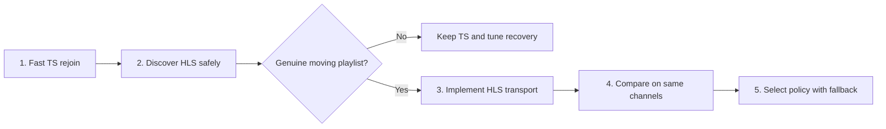

# Live Transport Recovery Micro-project

## Status

**Phase 1 implemented and verified; Phases 2–5 gated.** The 159-test portable
native suite and Windows cross-build passed on 2026-08-11. Provider soaks
established the real failure shapes and validated ordinary cache-stall and EOF
recovery plus late-frame admission after `Failed`. Deterministic application-
sequencing simulations now close the two timing cases that need not recur by
chance: a first frame during retry backoff cancels the unissued reopen, and a
recovered load with advancing input/cache evidence but no presentable frame
still crosses the eight-second opening bound. Credential-safe Phase 2 research
found that this account advertises and delivers MPEG-TS only. The research
implementation was removed, so Phases 2–5 remain proposed and gated for this
provider; no HLS capability discovery, playback or fallback is implemented.

## Outcome

Restore live pictures quickly when a provider stream fails, then add genuine HLS
support and determine from field evidence which transport is better for this
provider.

For continuous progressive MPEG-TS, recovery means **fast rejoin**, not
fast-forward or gap repair. Coax abandons an unhealthy load and accepts the first
current frame supplied by a fresh request. Content emitted while the connection
was dead may be permanently unavailable.

If the provider offers a genuine moving HLS playlist, Coax can additionally use
an addressable live window, segment-level failures and a defined near-live start
position. HLS should become the preferred transport only if measurements show
that the provider's implementation is healthier at acceptable latency.

## Current baseline

- `xtream::Client::stream_url` always constructs a `.ts` live URL.
- `App` marks every Xtream channel load as `RecoveryTransport::MpegTs`.
- The supervisor models MPEG-TS and HLS separately, but the application cannot
  currently select the HLS branch.
- The latent HLS branch uses `live_start_index=-1`; this must not ship as normal
  HLS startup because it chooses the last advertised segment.
- Source reopen, bounded attempts, clean probation, generation filtering and
  unexpected-live-EOF recovery are implemented.
- After first frame, `paused-for-cache=yes` may suppress recovery for ten
  seconds only while playback makes no meaningful forward progress. A confirmed
  cache stall has its own telemetry reason and enters the ordinary bounded
  source-reopen path.
- Before first frame, every load remains subject to the existing eight-second
  open-stall confirmation even if MPEG-TS bytes arrive, cache timestamps move or
  mpv exposes a readable playback timestamp. Those signals do not prove that a
  presentable frame exists.
- For progressive TS, two reopened loads that stall or end before clean
  probation trigger one full in-process mpv recreation. Later failures stay in
  the same bounded episode and cannot trigger another short-load recreation.
- Every command within a generation has a monotonic load-attempt identity.
  Signed movement and credential-safe recovery telemetry divide the episode
  into decision, command, first-frame, renewed-failure and probation phases.
- An exact current load that produces its first frame while its opening-stall
  source retry is still waiting in backoff cancels that unissued retry and
  enters Zap probation. Recreation-class recovery is never cancelled this way.
- Command exhaustion leaves `Failed` explicit, but the exact current
  opening-stalled load has one credential-safe, command-free admission to Zap
  probation if its first frame arrives late. Failure consumes that admission;
  clean probation is the only event that resets the episode.
- First-frame timing is episode-local. Clean probation clears it, while a
  recovered load's total lifetime remains available as a separate measurement.

The field evidence motivating this project is in
[the live-playback evidence report](../evidence/coax-live-playback-evidence-report.md).

## Guiding rules

1. Optimize progressive TS for time to a healthy current-live frame.
2. Do not restart from a generic timestamp-discontinuity count.
3. Let short, explicit cache buffering absorb ordinary jitter before reopening.
4. Keep source reopen and player recreation inside one bounded recovery episode.
5. Do not claim the provider supports HLS until a credential-safe check proves it.
6. Do not call an HLS URL healthy merely because it returns a playlist; its media
   sequence and playable window must continue advancing.
7. Keep transport selection explicit and generation-scoped. Never infer it from
   an arbitrary HTTP URL after the load begins.
8. Treat ExoPlayer/Media3 as a strategy reference, not a set of constants to copy.

## Phase 1 — Fast progressive-TS rejoin

### Behavior

- Keep playing through an isolated backward timestamp reset if forward playback
  resumes normally.
- Give `paused-for-cache=yes` a ten-second buffering grace period while
  playback makes no meaningful forward progress. Reset that grace on progress
  or pause exit, then report a distinct cache stall if it expires.
- Reopen promptly when confirmed unpaused playback makes no progress.
- Treat unexpected EOF on an active live load as a source failure and reopen
  immediately or with only hot-loop protection.
- If reopened loads repeatedly end or stall before clean probation succeeds,
  escalate once to full in-process mpv recreation.
- Preserve the original attempt count and recovery start time through first frame,
  repeated short loads and player recreation.
- End in the existing explicit Failed state when the attempt or wall-clock budget
  is exhausted.

The existing health thresholds and backoff schedule are measurement baselines,
not acceptance criteria. Tune them only after the phase timings below are visible.

### Required telemetry

Every recovery attempt records, without a stream URL:

- provider session, channel-session alias, generation and load-attempt ID;
- fresh-selection, recovery-reopen or player-recreation intent;
- last forward progress to fault-decision duration;
- fault decision to issued recovery command;
- recovery command to first frame;
- first frame to clean probation, renewed stall or EOF;
- recovered-load lifetime and terminal outcome;
- pause state, signed playback movement, cache-end movement and sanitized engine
  category at the decision.

### Acceptance gate

Automated verification completed on 2026-08-09:

- an observed six-second ordinary cache pause does not produce a recovery
  signal, while sustained cache-paused no-progress crosses the ten-second grace
  into a distinct bounded source reopen;
- an isolated legitimate timestamp reset does not produce a recovery signal;
- a pre-first-frame load that keeps receiving input and cache timestamps but
  never presents a frame still crosses the eight-second open-stall bound;
- confirmed unpaused no-progress and active unexpected EOF do reopen;
- repeated short-lived recovered loads escalate once to player recreation;
- recreation preserves the original attempt count, start time and wall-clock
  budget;
- exhaustion enters the explicit Failed state;
- stale generations, load-attempt events and recovery effects cannot replace
  or revive the current load;
- a first frame during opening-stall backoff cancels only an unissued source
  retry and still requires five clean seconds;
- the exact current load can enter one bounded probation from command-exhausted
  `Failed`, with health supervision resuming and no new recovery command; and
- clean probation clears episode-local first-frame timing, so a later fault is
  a new `fault-decided` outcome rather than a historical renewed failure.

The first credential-safe soak ran for 1h58m with one generation and one load
attempt. It confirmed that isolated backward movement and ordinary buffering do
not reopen. It also exposed cache-paused freezes of 74.6s and 116.0s with only
0.16s and 0.22s of playback movement; the then-unbounded buffering exemption
prevented recovery. No reopen or recreation occurred during that run.

The bounded cache-stall clock deliberately requires readable playback-time
evidence. Missing playback time resets it rather than manufacturing a stopped
timeline. The soak had continuous evidence through every sampled pause, so it
does not establish whether a harder provider or engine failure can lose that
property and remain cache-paused indefinitely. This is a known conservative
limit to observe in the follow-up run, not a basis for inventing a missing-data
recovery rule now.

A later provider soak reproduced the same bounded failure sequence in two
independent generations. Each entered cache recovery after 10.584 seconds of
paused readable no-progress, open-stalled twice at about 8.06 seconds, escalated
exactly once to in-process player recreation, and reached `Failed` /
`budget-expired` at about 27.8 seconds. No recovery command was issued after
`Failed`. The already-issued recreation loads nevertheless remained alive:
generation 1 became ready 61.21 seconds after its command, about 53 seconds
after `Failed`; generation 2 became ready after 26.10 seconds, about 18 seconds
after `Failed`. Because the old application skipped health sampling in
`Failed`, both then played outside supervision and later engine failures caused
no further bounded decision.

The same evidence exposed an independent startup race: an initial load produced
its first frame after opening-stall was decided but before the retry effect was
issued. The old supervisor ignored the frame while `Recovering`, so the retry
replaced a now-playing load and added roughly four seconds to picture recovery.
It also exposed episode leakage: a later cache fault on a long-steady recovered
load retained an hour-old first-frame duration and was labelled renewed solely
from historical `RecoveryReopen` intent.

A follow-up soak validated two ordinary cache-stall reopens and confirmed that
a later EOF after clean probation began a fresh telemetry episode with no stale
first-frame duration. It also exposed another opening shape. Generation 2's
first reopen reported ready after 8.00 seconds and continued receiving MPEG-TS
data, advancing cache timestamps and emitting heavy decoder errors, but never
produced `FirstFrame`. The old pre-frame fold treated that activity as neutral,
so the supervisor remained in Zap for about 2m16s until a user reload. One cache
timestamp jumped by about 95,087 seconds; the fresh load then produced a frame
in 3.802 seconds and completed clean probation in 5.732 seconds. A presentable
frame, not transport activity, now bounds the opening state while preserving the
same eight-second threshold and recovery budget.

A corrected-binary soak then ran for about 1h25m across five generations. In
generation 5, an unexpected EOF reopened after 505ms; that load produced no
frame and open-stalled after 8.064 seconds, proving the shipped first-frame
bound still advances recovery when all playback and cache telemetry is
unavailable. The next reopen produced a frame in 6.280 seconds and completed
clean probation in 5.778 seconds. About 32m23s later another EOF began a fresh
episode, reopened after 505ms, produced a frame in 4.884 seconds and completed
probation in 5.662 seconds. Health sampling remained active for the rest of the
run. There was no recreation, `Failed`, budget exhaustion, late-frame loop or
credential-bearing diagnostic.

The run validates the corrected runtime's bounded no-frame path for unavailable
telemetry, ordinary EOF recovery and post-probation episode reset. It did not
reproduce the stronger data-delivering/no-frame shape, an accepted late frame
after `Failed`, or a first frame inside retry backoff.

A subsequent credential-safe provider capture validated the late-frame path
after command exhaustion. The already-issued recreation load produced its first
frame 2.575 seconds after `Failed`, completed probation and returned to
supervised Steady without issuing another recovery command.

On 2026-08-11, permanent virtual-time application-sequencing tests closed the
two remaining acceptance cases. The fixture follows the application's actual
turn order through the player event adapter, health fold, supervisor host and
synchronous recovery-effect settlement. It proves that a first-playback edge at
8.25 seconds cancels the retry due at 8.5 seconds and still completes five-second
probation, and that an EOF-recovered load with advancing input/cache evidence,
a stale playback clock and no first-playback edge open-stalls after eight
seconds while preserving the recovery episode. Earlier provider captures had
already established that both input shapes are real; their random recurrence in
a corrected soak is continuing observation rather than an acceptance gate.

## Phase 2 — Credential-safe transport discovery

### Behavior

- Read the account's advertised output formats when the provider API exposes
  them, retaining only normalized capability values such as `mpeg-ts` and `hls`.
- Do not persist the raw account response, authenticated URL, username, password,
  query value, cookie, authorization header or provider host.
- If metadata does not establish HLS support, offer an explicit one-shot
  capability probe rather than silently rewriting every `.ts` URL.
- Validate that an HLS candidate is a playlist and that a live media playlist
  advances. A static, malformed or non-playlist response is not HLS support.

### Acceptance gate

- Accounts advertising only TS behave exactly as before.
- HLS capability can be represented without storing provider identity or secrets.
- Authentication failure is terminal and does not become a format-probing loop.
- Probe diagnostics contain request shape and outcome only, never the target.

### Research outcome (not shipped)

Credential-safe account metadata research on 2026-08-10 reported
`advertised=yes`, `mpeg-ts=yes` and `hls=no`; the normalized preference remained
MPEG-TS. A local Phase 2b prototype then ran the explicit bounded HLS probe on
two channels. Each probe completed after one sample with no playlist wait and
the outcome `http-unavailable`. Its diagnostics retained only process-local
provider/channel aliases, method, target shape, sample count, wait, outcome and
preference—not a URL, host, account field, response body or secret.

A provider-exported M3U catalogue supplied the same day contained 935
extensionless HTTPS playback entries under one credential-bearing route shape.
Credential-safe sampling followed the route's redirect. The available samples
had MPEG-TS packet synchronization rather than an HLS playlist signature; a
third sample delivered no data. No catalogue entry or credential was copied
into the repository or retained in diagnostics.

Together, these observations establish an alternate MPEG-TS route but no usable
HLS route for this account. The capability and probe implementations were
removed rather than shipped, MPEG-TS remains selected, and Phase 3 or later HLS
work is gated until a provider account with genuine HLS capability is available.

## Phase 3 — Real HLS transport

### Behavior

- Resolve HLS before issuing the load and carry `RecoveryTransport::Hls` through
  the player, supervisor, effects and diagnostics.
- Leave normal playlist refresh, segment fetching and prefetch inside FFmpeg/mpv.
- Remove `live_start_index=-1`. Honor a valid provider `EXT-X-START` when
  supported; otherwise retain a conservative demuxer live-start default unless
  field data justifies moving closer to the edge.
- Do not disable persistent or multiple HTTP connections without a reproduced
  provider-specific fault.
- Keep normal playlist refresh distinct from retries caused by errors.
- Surface playlist failure, segment unavailability and exhaustion to the outer
  supervisor under one documented total recovery budget.

### Acceptance gate

- The complete application path, not only the reducer, can select and play HLS.
- A moving test playlist refreshes normally without supervisor intervention.
- Missing segments and a stuck/failed playlist produce distinct sanitized causes.
- Recovery re-prepares near the live position rather than resuming an obsolete
  segment or always choosing the final advertised segment.
- Channel changes during playlist activity remain generation-safe.

## Phase 4 — Provider comparison

Compare TS and HLS on the same representative channels and time periods. Record:

| Measure | Why it matters |
|---|---|
| Selection to first frame | Startup cost |
| Median and tail live offset, where observable | Viewer latency |
| Rebuffer count and duration per hour | Normal stability |
| Fault decision to first recovered frame | Recovery speed |
| Recovery success and terminal-failure rates | Recovery reliability |
| Repeated short-load or EOF rate | Provider/source health |
| HLS playlist advancement and segment failures | Whether HLS adds usable recovery structure |
| Memory, CPU and warning categories | Runtime cost and regressions |

Do not compare a strong channel on one transport with a weak channel on the
other. Do not infer content identity from equal media timestamps. If users still
report advancing pictures or audio repeating, run a separate fingerprint or
credential-safe wire investigation.

### Decision gate

- Prefer HLS when its playlist advances reliably, recovery succeeds more often
  and its startup/live-latency cost is acceptable.
- Prefer TS when HLS is unavailable, stale, malformed, materially less reliable
  or unacceptably delayed.
- Retain both transports unless provider evidence makes one uniformly unusable.

## Phase 5 — Selection and fallback policy

Start with an explicit account/session preference based on the Phase 4 result.
Avoid per-failure transport oscillation until both paths are proven.

If automatic fallback is later justified:

- allow at most one transport switch inside the existing recovery episode;
- preserve generation, attempts and the wall-clock budget across the switch;
- record why the preferred transport was abandoned;
- apply cooldown or session stickiness so one bad segment cannot cause flapping;
- never turn authentication or account-capability failure into fallback retries.

The intended end-state is:

| Source | Normal recovery |
|---|---|
| Progressive TS | Buffer grace, then fast fresh rejoin to current provider output |
| HLS | Normal playlist/segment handling below Coax; re-prepare near live when the window or playlist fails |
| Either, repeatedly unhealthy | Bounded outer recovery, optional mpv recreation, then explicit Failed state |

## Out of scope

- Recovering progressive-TS content the provider never delivered.
- Timeshift, DVR or recording.
- Treating timestamp rollback alone as proof of repeated content.
- Replacing libmpv.
- Low-latency HLS until ordinary HLS is supported and measured.
- Automatically preferring HLS merely because an endpoint returns HTTP success.

## Delivery slices

1. **Done:** add phase-specific recovery timing and load-attempt identity.
2. **Done:** add repeated-short-load classification and bounded recreation
   escalation.
3. **Done:** portable supervisor/player tests and the Windows cross-build are
   green; provider evidence covers late admission after `Failed`, and permanent
   virtual-time application-sequencing tests cover data-delivering/no-frame and
   retry-backoff first-frame behavior.
4. **Closed without shipping:** use local credential-safe account metadata to
   establish that this account advertises MPEG-TS but not HLS, then remove the
   research implementation.
5. **Closed without shipping:** use a local bounded HLS probe and the provider's
   M3U catalogue to corroborate MPEG-TS delivery and no usable HLS route, then
   remove the probe implementation.
6. **Gated:** make transport selection explicit only when an account with
   genuine HLS capability is available.
7. **Gated:** correct HLS startup and connection policy, then add
   application-level HLS tests.
8. **Gated:** run a provider comparison and document the selected default.
9. Consider automatic fallback only after both transports meet their acceptance
   gates.

## Definition of done

- TS failure recovery is fast, bounded and measured.
- Provider HLS availability is known without credential leakage.
- Genuine HLS can be selected through the complete application path.
- TS and HLS have been compared on the same representative channel set.
- The chosen default and fallback are supported by retained sanitized evidence.
- Documentation distinguishes provider/content loss from player-health recovery.
- Every new player/core behavior has native tests under `test/`.

## References

- [Live Playback Design](live-playback.md)
- [Media3 live-streaming guidance](https://developer.android.com/media/media3/exoplayer/live-streaming)
- [Media3 HLS support](https://developer.android.com/media/media3/exoplayer/hls)
- [Media3 default load-error policy](https://developer.android.com/reference/androidx/media3/exoplayer/upstream/DefaultLoadErrorHandlingPolicy)
- [RFC 8216 live playlist responsibilities](https://datatracker.ietf.org/doc/html/rfc8216#section-6.3.3)
